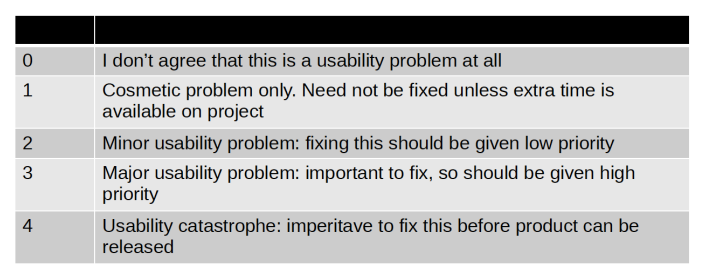

# 11 - Design Principles and Heuristics

## Design Principles

### Visibility

Visibility is concerned with making relevant parts of the design visible, i.e., making the tasks at hand easy to see and find. User should be able to know what he can do clearly.

### Feedback

Involves sending information back to the user about what has been done. It has to be responsive.

### Constraints

Refers to determining ways of restricting the possible actions that can be performed by the user, preventing incorrect options.

### Consistency

Refers to design interfaces to have similar operations and use similar elements for achieving similar tasks. An example arre shortcuts.

### Affordance

Refers to an attribute of an object that allows people to know how to use it (i.e., possibilities for action).

### Simplicity

Simple things work better and are easier to use; in UX terms they are more beautiful. KISS method (Keep It Simple Stupid), less is more.

## 10 usability heuristics for UI design (by Jakob Nielsen)

They are used mainly as the basis for **evaluating systems**. They provide a framework for heuristic evaluation.

### Visibility of system status

The system should always **keep users informed** about what is going on, through appropriate feedback within reasonable time. An example are progress bar. A lack of information often equates to a lack of 
control.

You don’t need always to show all the states of a system, especially the internal status, usually not needed by users.

### Match between system and the real world

Follow real-world conventions, making information appear in a **natural and logical order**. They demonstrate empathy and acknowledgement for users.

Familiar words are also better for **SEO** (Search Engine Optimization), because they are what users search for.

### User control and freedom

Users often choose system functions by mistake and will need a clearly marked “emergency exit” to 
**leave the unwanted state** without having to go through an extended dialogue. Examples are undo and redo.

### Consistency and standards

Users should not have to wonder whether different words, situations, or actions mean the same thing. Follow **conventions**.

### Error prevention

Even better than good error messages is a careful design which prevents a problem from occurring in the first place.

### Recognition rather than recall

Minimize the user’s memory load by making objects, actions, and options visiblen The user should not have to remember information from one part of the interface to another.

### Flexibility and efficiency of use

Accelerators — unseen by the novice user — may often speed up the interaction for the expert user such that the system can cater to both inexperienced and experienced users. Basically give users more ways to complete a task.

### Aesthetic and minimalist design

Interfaces should not contain information that is irrelevant or rarely needed. **Signal to noise ratio concept**.

### Help users recognize, diagnose, and recover from errors

Error messages should be expressed in plain language (no codes), precisely indicate the problem, and 
constructively suggest a solution.

### Help and documentation

Even though it is better if the system can be used without documentation, it may be necessary to provide help and documentation.

## Rating of Usability

## Universal Design

Universal design is the design of buildings, products or environments to make them **accessible** to all people, regardless of age, disability or other factors.

# The 7 principles of universal design

### Equitable Use

The design is useful and marketable to people with diverse abilities.

**Guidelines**

1. Provide the same means of use for all users: identical whenever possible; equivalent when not

2. Avoid segregating or stigmatizing any users

3. Provisions for privacy, security, and safety should be equally available to all users

4. Make the design appealing to all users

> Use strong colour contrast to avoid stigmatizing users with colour blindness.

### Flexibility in Use

The design accommodates a wide range of individual preferences and abilities.

**Guidelines**

1.  Provide choice in methods of use

2. Accommodate right- or left-handed access and use

3. Facilitate the user’s accuracy and precision

4. Provide adaptability to the user’s pace

> Provide customization for dashboards

### Simple and Intuitive Use

The use of the design is easy to understand, regardless of the user’s experience, knowledge, language skills, or current concentration level.

**Guidelines**

1. Eliminate unnecessary complexity

2. Be consistent with user expectations and intuition

3. Accommodate a wide range of literacy and language skills

4. Arrange information consistent with its importance

5. Provide effective prompting and feedback during and after task completion

> Reduce visual clutter with **Progressive Disclosure**

### Perceptible Information

The design communicates necessary information effectively to the user, regardless of ambient conditions or the user’s sensory abilities.

**Guidelines**

1. Use different modes (pictorial, verbal, tactile) for redundant presentation of essential information

2. Provide adequate contrast between essential information and its surroundings

3. Maximize “legibility” of essential information

4. Differentiate elements in ways that can be described (i.e., make it easy to give instructions or directions)

5. Provide compatibility with a variety of techniques or devices used by people with sensory limitations

> Enable users with hearing impairments to watch videos with Video Transcription

<mark>!!! special mode for disabilities in tower</mark>

### Tolerance for Error

The design minimizes hazards and the adverse consequences of accidental or unintended actions.

**Guidelines**

1. Arrange elements to minimize hazards and errors: most used elements, most accessible; hazardous elements eliminated, isolated, or shielded

2. Provide warnings of hazards and errors

3. Provide fail safe features

4. Discourage unconscious action in tasks that require vigilance

> Reduce submission error with Form Validation

### Low Physical Effort

The design can be used efficiently and comfortably and with a minimum of fatigue.

**Guidelines**

1. Allow user to maintain a neutral body position

2. Use reasonable operating forces

3. Minimize repetitive actions

4. Minimize sustained physical effort

> Minimalize mouse usage with Keyboard Shortcuts

### Size and Space for Approach and Use

Appropriate size and space is provided for approach, reach, manipulation, and use regardless of user’s body size, posture, or mobility.

**Guidelines**

1. Provide a clear line of sight to important elements for any seated or standing user

2. Make reach to all components comfortable for any seated or standing user

3. Accommodate variations in hand and grip size

4. Provide adequate space for the use of assistive devices or personal assistance

> Consider the Target Area of your website when it is on mobile devices
