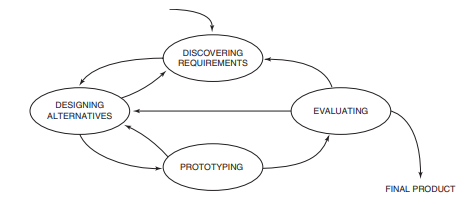

# Discovering Requirements

**Objective**:

1. Explore the problem space (PACT)

2. Establish a description of what will be developed



The process is **iterative**.

 A requirement is a **statement** about an intended product that specifies what it is expected to do or how it will perform.

Requirements should be as specific, unambiguous, and clear as possible.

They can be **functional** or **non functional**.

## Volere Shell

https://www.volere.org/


## User stories

```bash
As a <role>, I want <behaviour> so that <benefit>
```

A user story serves as a **starting point** for a conversation to extend and clarify requirements. User stories may also be used to capture **usability and user experience goals**. User stories are most prevalent in **agile** development contexts.

## Functional Req (skip)

## Non functional Requirements

- Data requirements - what will be stored and how

- Environment or context 
  
  - physical
  
  - social
  
  - organizational
  
  - technical

- User Charatteristics
  
  - novices
  
  - experts
  
  - frequent
  
  - casual

- Usability and UX goals

## Personas and Scenarios


