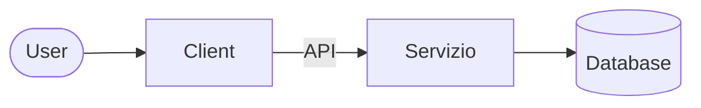

# Introduzione

L'idea di progetto è legato al concetto di **servzio**.

## Cosa useremo?

- Javascript

- Editor/IDE

- Git e Github

- Travis

- MongoDB

- (altro...)

## Obiettivo

Fornire agli studenti concetti, approci e tecniche per l'analisi, il design e lo sviluppo del software.

1. definire i migliori processi di sviluppo e modelli

2. rappresentare tramite diagrammi i requisiti, le architetture, le interazioni e il deploy

3. requisiti funzionali (es. registrazione utente, crud) e non funzionali (safety, security and usability, or scalability)

4. refinement, astrazione, modularità indipendenza e refactoring

5. definire i componenti di un sistema software

6. agile development

7. RESTful API, collaboration, automation (DEV Ops CI/CD)

## Software Development Process

Un'insieme di attvità, regole e linee guida che indicano come fare design, sviluppo, consegna e manutenzione del software. È importante seguire un processo per evitare errori e rallentamenti.

### Waterfall model

Tutte le fasi del software sono fate una dietro l'altra.

*immagine waterfall*

### Agile model

Si ha un team più piccolo che integra regolarmente con piccoli cambiamenti.

> Our highest priority is to satisfy the customer  through early and continuous delivery  of valuable software.

*Il primo dei 12 princìpi del modello Agile*

### API

Application Programming Interface vengono usate per interfacciarsi al software.

L'API fornisce una specifica, la chiave è la stabilità.

DBMS e API esterne sono servizi a loro volta a cui interagiamo tramite il nostro servizio.

### Software Versioning

Relases through Collaborative Software

### Testing

The process of executing a program with the intent of finding bugs.

- test suite

- coverage

### Deploy

- pre-production environment

- production environment

### DevOps
