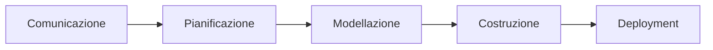

# Modelli e Processi nell'Ingegneria del Software

> L’ingegneria del software è l’istituzione e l’impego di principi ingegneristici ben fondati, allo scopo di ottenere in modo economico software affidabile ed efficiente

> Più che una disciplina o insieme di conoscenze, è un modo di affrontare un problema

> (1) applicazione di una strategia sistematica, disciplinata e misurabile allo sviluppo, esercizio e manutenzione del software; (2) studio di strategie di cui al punto (1)

L'ingegneria del software si occupa di:

- Planning

- Analysis

- Design

- Programming

- Implementation

- Development

- Testing

- V&V

Il **processo** di creazione di un software utilizza **metodi**, tramite **strumenti**. In tutto il processo particolare attenzione è alla **qualità**.

## Modello di processo a cascata

Sapendo a priori i requisiti:

1. inizio progetto, raccolta requisiti

2. stima, piaificazione, controllo

3. analisi, design

4. programmazione, testing

5. consegna, suppoorto, feedback

*esempio IBM*

## Modello di processo incrementale

Ovvero aggiungo funzionalità poco alla volta

## Modello a prototipi

## Prototipi

> Una rappresentazione di un prodotto o di un sistema, o di una sua parte, che, anche se in 
> qualche modo limitata, può essere utilizzata a scopo di **valutazione**.

- **Wireframe**: il focus è nella user experience design (trovare la migliore user experience).

- **Mock-up**: rappresenta la fase successiva in cui gli elementi del design entrano in gioco (colore, caratteri, immagini, etc) – si hanno più dettagli per dimostrare il look and feel (quello che sarà il prodotto).

## Modello a Spirale

 [La modellazione a spirale è un modello procedurale per lo sviluppo di software che si basa sull’analisi e la gestione dei rischi](https://www.ionos.it/startupguide/produttivita/modello-a-spirale/)[1](https://www.ionos.it/startupguide/produttivita/modello-a-spirale/)[2](https://www.ionos.it/startupguide/produttivita/modello-a-spirale/). [Il modello a spirale prevede quattro fasi principali: pianificazione, analisi dei rischi, sviluppo e verifica](https://www.ionos.it/startupguide/produttivita/modello-a-spirale/)[2](https://www.ionos.it/startupguide/produttivita/modello-a-spirale/). Queste fasi si ripetono ciclicamente fino al completamento del software.

La modellazione a spirale richiede più tempo e risorse per l’analisi dei rischi ma offre una maggiore flessibilità e adattabilità ai cambiamenti. La modellazione a processo incrementale richiede una definizione chiara dei requisiti e delle funzionalità ma offre una maggiore soddisfazione del cliente e una migliore qualità del software.

## Modello a Componenti

Ovvero vengono usati componenti software con funzionalità specifiche e interfacce ben definite.

Usare componenti consente di suddividere progetti complessi in cose pià semplici. Attenzione ai diversi environment dove viene usato il componente.

## Modello a Servizi

## Model Driven Development

## Metodo Agile

### Documentazione

## Metodo SCRUM

## Extreme Programming

### Programmazione

### Testing

## DevOps

## Modularizzazione e microservizi

