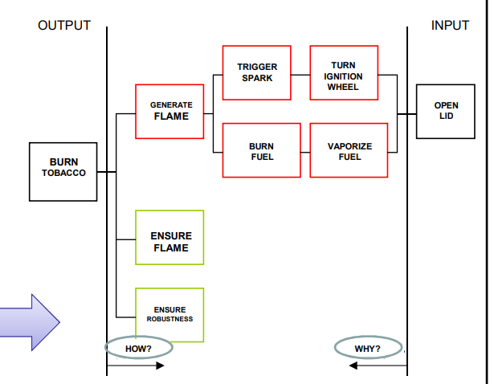
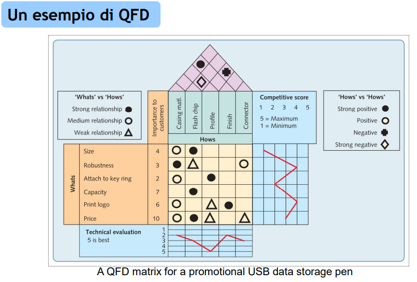
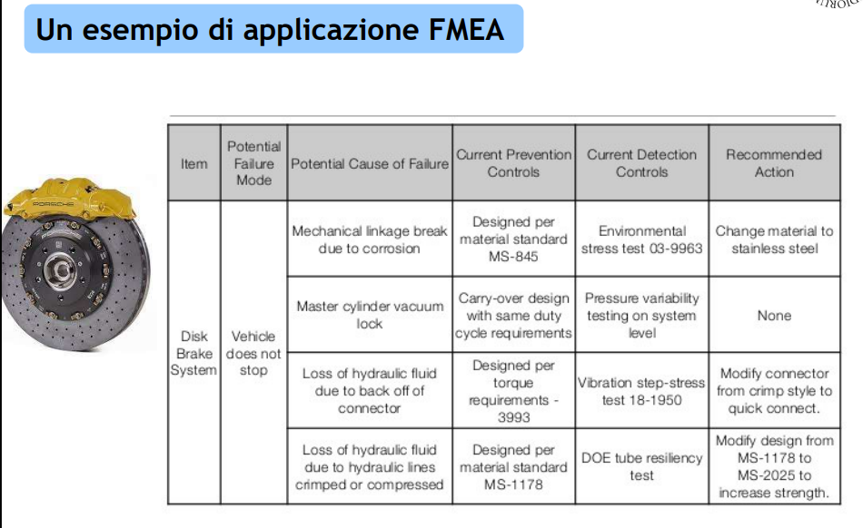
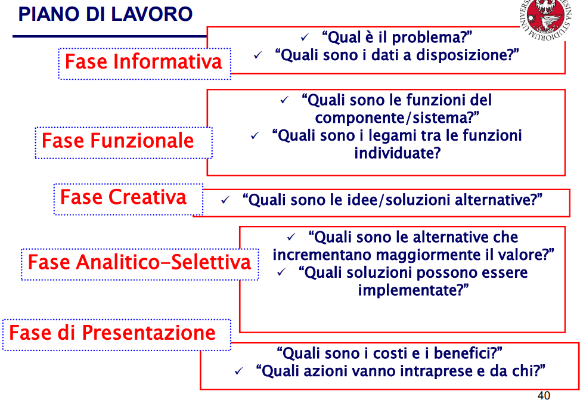

# Sviluppo di un nuovo prodotto e Analisi del valore

Evitare un fallimento nel lancio vuol dire:

- avere un piano di scalabilità della produzione

- ritardare il lancio fino a che il prodotto non è rifinito

- testare il prodotto

- far capire all'utente come va utilizzato il prodotto

La progettazione passa sia da quella dei **prodotti e servizi** sia quella dei **processi**. è importante pensare al ciclo ricorsivo **cliente, marketing e progettazione**.

Le fasi del ciclo di vita di un prodotto si riassumono con:

1. Introduzione nel mercato

2. Crescita nel mercato

3. Maturità del prodotto

4. Declino

## Aspetti chiave di un prodotto

- **concept** - i benefici che apporta al cliente

- **package** - l'insieme di prodotti che incrementano l'efficacia del prodotto

- **process** - tutti le fasi di creazioni del prodotto

## Modello Stage-Gate

### 1. Ideazione del Concept

che proviene da R&D, ricerche di mercato, competitors, consigli dei clienti. Dall'idea si deve convergere verso il **concept** dove sono definite le funzioni, la forma, i benefici e lo scopo del prodotto. Per definire le funzioni di un prodotto.

**FAST** Functional Analysis S... Technique

### 2. Screening

Che passa attraverso **fattibilità, accettabilità e vulnerabilità**. Queste valutazioni valgono sia nel livello di produzione ma anche a livello finanziario e di marketing

### 3. Progettazione preliminare

Si definiscono i prodotti, i servizi e i processi alla creazione del package. La struttura che distingue un prodotto si chiama **Bill Of Materials (Distinta Base)**. 

Il concetto di **Preliminary design** consiste nell'avere fattori di modularità, mass customization, standardizzazione, comunanza (es. piattaforme auto).

**Simultaneous Concurrent Engineering [more...]**

### 4. Valutazione e miglioramento

Valutazione delle alternative e miglioramenti prima del lancio.

Tecniche di supporto comunemente utilizzate:

- Quality Function Deployment (QFD)
  
  

- Analisi del Valore (AV)

- FMEA (Failure Mode and Effects Analysis)
  
  

### 5. Prototipazione e progettazione finale

Traduzione del progetto preliminare in prototipo per il test.

Tecniche di supporto comunemente utilizzate:

- Prototipazione virtuale

- CAD

## Analisi del Valore

Il valore è il rapporto tra la soddisfazione delle esigenze e l'utilizzo delle risorse, per ottenere la più favorevole situazione di equilibrio.

L'"oggetto AV" può essere un prodotto già esistente o un prodotto nuovo in via di sviluppo. La procedura di analisi del valore è attuata da una **squadra AV** ed è caratterizzata da un **piano di lavoro AV**.

> Ad esempio Toyota e Fiat che tramite questa analisi hanno ridotto i costi per la produzione dei motori per autoveicoli.

1. Fase Informativa

2. Fase Funzionale

3. Fase Creativa

4. Fase Analitico-Selettiva

5. Fase di Presentazione

**L’Indice di Valore** è il parametro analitico ed oggettivo, formulato dal gruppo di lavoro competente. Evidenzia la soluzione più conveniente in base a due variabili:

- Utilità - soddisfazione delle esigenze

- Costi globali - costi dell'intero ciclo di vita

> Esempio Fincantieri
> 
> 1. schemi e normative vigenti
> 
> 2. diagramma fast
> 
> 3. idee sulla scelta dei materiali
> 
> 4. creazione di indici e classi di esigenza
> 
> 5. presentazione al committente

# Domande aperte all'esame

Porter, segmentazione -_> punta tutto sugli esempi_

è tutta una questione di tempo, costo e consegna. è così che selezioniam i nostri fornitori. 

- descrivere le principal attviità ed obiettivi del processo di selezione e valutazione dei fornitori

- con riferimento ad esempi pratici, valutate in modo critico la dichiarazione di cui sopra 

! diverse componenti -> ognuno richiede una riisposta. Nel caso di uno statement fate attenzione al contenuto. Possibile analisi critica.

Uso di schemi grafici

POssibili altri cirteri da analizzare rispetto a quelli segnalati, hano gli stessi pesi?
