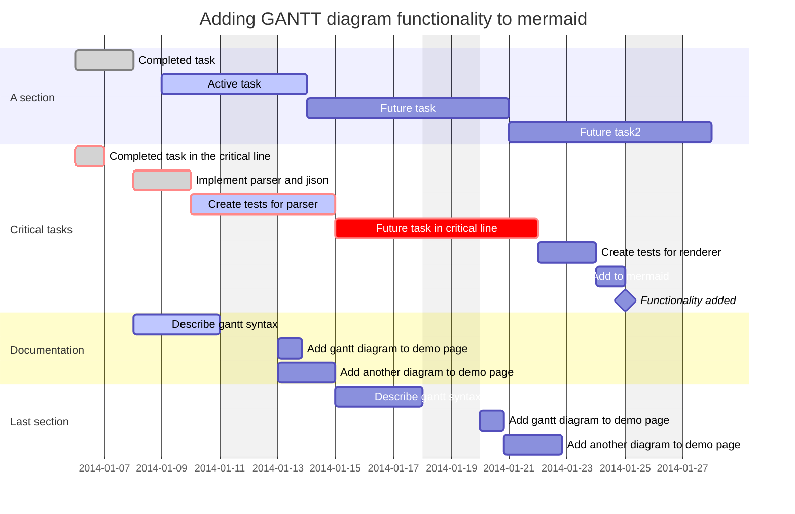

# 11 - Project Management

## Definizioni

- programma: iniziativa a lungo termine, insieme di progetti

- progetto: insieme complesso di attività integrate, con budget e obiettivi, con inizio e fine in 3 anni max

- compito: sforzo a breve termine

Il processo di **project management** ha come obiettivo ultimo il raggiungimento degli obiettivi strategici dell'organizzazione e la pianificazione/controllo dei progetti. Le fasi di p.m. quindi si dividono in **pianificazione** e **controllo**.

In un progetto le **variabili** sono i tempi, i costi, le risorse e le qualità.

## Gestione dei tempi

### Diagramma di GANTT

## Gestione dei costi

- **BCWS** (Budget Cost of Work Scheduled) – costo pianificato

- **ACWP** (Actual Cost of Work Performed) – costo effettivamente sostenuto

- **BCWP** (Budget Cost of Work Performed) – valore delle attività realizzate fino a quel momento

## Gestione delle risorse

Si pensi allo schema di organizzazione a matrice (Capitolo 2).

Il **manager di funzione** assicura efficienza ed efficacia nella sua funzione.

Il **manager di progetto** si preoccupa di indirizzare le risorse per raggiungere gli obiettivi.

### Matrice RACI

Serve per assegnare le responsabilità. Responsible, Accountable (responsabile del responsabile, es Vice President Product), Consulted, Informed.

### Project Manager

Il PM deve possedere abilità organizzative, gestionali e relazionali ed è la figura che individua, impegna e coordina 
le risorse al fine di conseguire gli obiettivi di costi e tempi (e qualità) del progetto. Aspetti chiave di un PM sono:

- avere una visione globale del progetto

- anticipare le richieste di mercato

- coordinare risorse

- essere una figura di leadership

- avere abilità di negoziazione

### Il Project Management Office (PMO)

Consiste in un'unità organizzativa che ha come obiettivo la direzione centralizzata e coordinata dei progetti di un'organizzazione. Assegna priorità e risorse.

# Luxottica Experience

## Who?

## Stakeholders

principalmente team esterni alla supply chain. I PM seguono end to end il progetto.

**New Product Introduction NPI**, 

BLM per monitorare il life cycle del prpodotto

model stock: scorte di emergenza per avere sempre materiale per la produzione

## Tasks

- 

- Portfolio management

- Project management
  
  - team leader, accountant, project manager

## a

process groups
