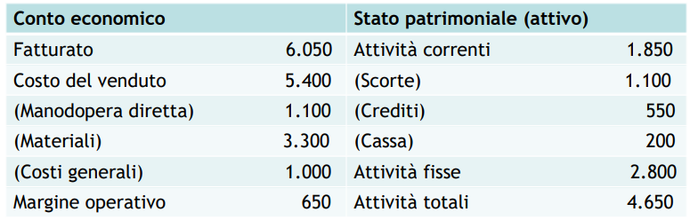

# 12 Introduzione al processo di acquisto industriale

## Il ruolo degli acquisti

Il ruolo degli acquisti contribuisce spesso per il 60-70+ % del prezzo finale del prodotto.

**Esempio**

**ROS (Return on Sales)**: Margine Operativo (EBITDA) / Fatturato

**ROA (Return on Assets)**: Fatturato / Totale attivo

Nel caso in cui aumenti il **fatturato** o diminuiscano i costi delle **materie prime**, il ROA aumenterà. Questo effetto è chiamato **effetto leva degli acquisti**.

**1/ROS** è l'inverso del margine sul fatturato.  Lo stesso aumento di margine operativo si può ottenere incrementando il fatturato del valore di questo inverso oppure ...

**Minore è il ROS, maggiore è l'effetto leva degli acquisti**. Nel *retail* infatti si deve compensare con elevati volumi di vendita e nella grande distribuzione è necessario agire sugli acquisti.

## Il processo di acquisto industriale

**B2B**: Business to Business

**B2C**: Business to Consumer

L'approccio è diverso fra utente finale e azienda.

Alcune differenze sono:

- professional purchasing

- domanda derivata (bullwhip effect)

- domanda non elastica

- grossi ordinativi

- conoscenza del prodotto

- minore "clientela"

- varie forme contrattuali

- forme di finanziamento complesse

- tempistiche più lunghe

Secondo Ford il mercato è una **rete di relazioni tra organizzazioni** e H&W aggiungono che tutte le relazioni sono influenzate dall'intero network.

Il processo parte dai dipartimenti di **vendite e acquisti** per mezzo di **sales manager e buyers**. (rispettivamente fornitore e compratore).

Le 6 fasi sono:

1. Definizione delle specifiche dei prodotti da acquistare

2. Identificazione dei fornitori potenziali e qualificazione

3. Selezione dei fornitori e negoziazione

4. Emissione degli ordini ai fornitori selezionati 

5. Monitoraggio e controllo degli ordini di acquisto

6. Post-acquisto e valutazione dei fornitori

Le prime tre sono fasi strategiche, le altre operative. CI si riferisce alle fasi anche come *sourcing (2-3)*, *buying (tutte meno la prima)* e *procurement (tutte le fasi)*.

Una cattiva qualità degli acquisti si traduce in una cattiva qualità in produzione (GIGO Garbage In Garbage Out).

Il processo di acquisto coinvolger un grande numero di attori e richiede cooperazione e comunicazione. Potrebbero sorgere problematiche sul prezzo, l'organizzazione, l'inesperienza...

## Il modello di Robinson, Faris e Wind

Esistono 3 casi di acquisto:

1. Nuovo acquisto

2. Riacquisto modificato

3. Riacquisto diretto

Il **Buygrid Model** si compone di 8 fasi:

1. Anticipazione e riconoscimento del problema

2. Determinazione delle caratteristiche desiderate per risolvere il problema

3. Descrizione delle caratteristiche e delle quantità del prodotto richiesto

4. Ricerca di potenziali fornitori e valutazione delle loro potenzialità

5. Acquisizione ed analisi delle proposte

6. Valutazione delle proposte e selezione dei fornitori

7. Selezione di una routine per l'ordine

8. Valutazione e feedback della performance dell'ordine
