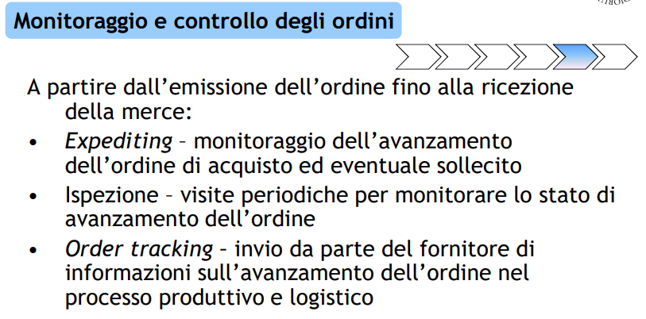
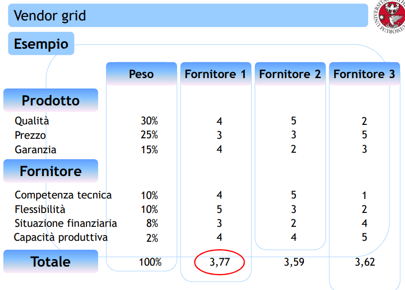
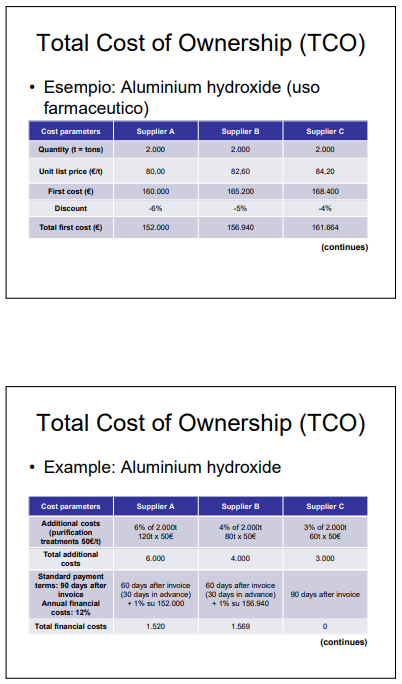
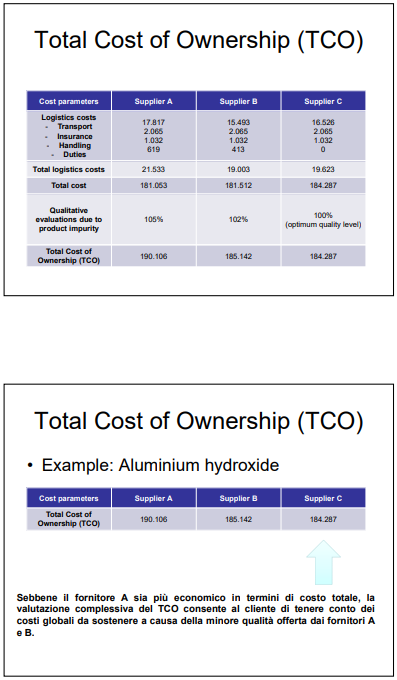
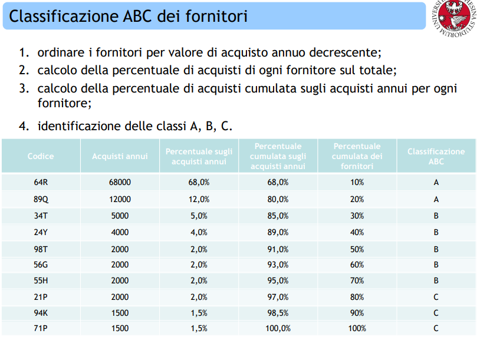

# 13 Strumenti operativi per la gestione del processo aziendale

I fornitori possono essere divisi in:

- fornitori potenziali

- fornitori approvati/qualificati

- fornitori preferenziali

La **Vendor List** è una lista di nuovi potenziali fornitori. Gli obiettivi del supplier assessment sono quelli di selezionare il fornitore più adatto e creare relazioni di medio-lungo termine.

Richiesta dei preventivi (richieste d’offerta) ai fornitori, in base alle specifiche precedentemente definite. Sulla base delle offerte ricevute vengono effettuate valutazioni che permettono la selezione dell’offerta migliore e la conseguente negoziazione con i potenziali fornitori per definire in dettaglio le offerte.

|  |  |  |
| -------------------------------------------- | -------------------------------------------- | -------------------------------------------- |

## Vendor Grid

Griglie per la valutazione dei fornitori in base a un punteggio (*vendor rating*). Valutazione ponderata, in base a diversi criteri (qualità, affidabilità...).

> Ad esempio ENEL sfrutta questo strumento per valutare fornitori e appaltatori. L'**Indice di Vendor Rating** viene basato su tre categorie fondamentali: **qualità, puntualità e correttezza**.

## Total Cost of Ownership

La tecnica del TCO permette di comparare i fornitori considerando tutti i **costi associati all’acquisto e all’utilizzo di un bene**. Ovvero viene calcolato il costo di **tutto** il ciclo di vita del prodotto (pre/in/post transazione).

|  |  |
| -------------------------------------------- | -------------------------------------------- |

## Analisi ABC

La classificazione ABC dei fornitori ha l'obiettivo di definire i fornitori critici all’interno del parco fornitori, ovvero su quali fornitori conviene concentrare le proprie forze.

**Percentuali: 80 - 15 - 5**

## AHP (Analytical Hierarchy Process)

1. Definire una relazione di priorità tra i criteri utilizzando il confronto a coppie

2. Dividere le celle per il totale della rispettiva colonna

3. Verifica della "coerenza"
   
   1. Calcolo della media per ogni riga
   
   2. Calcolo della somma ponderata per ogni criterio, data dalla somma dei risultati della media di ogni criterio per la sua 
      valutazione

4. Calcolo del parametro $\lambda$ che è la media delle medie pesate. Calcolo del **Consistency Index**.

5. Comparazione IC con **Random Index** (valori fissati di controllo)

6. Esplodere i pesi dei sotto-criteri
