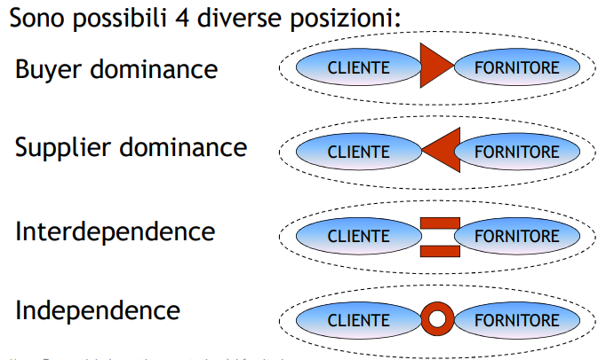
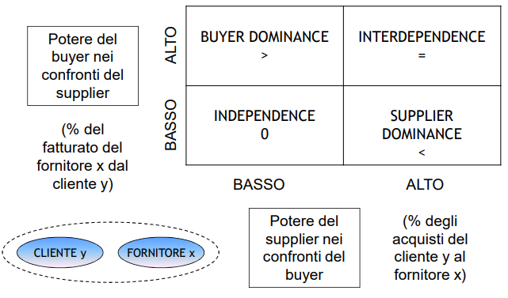
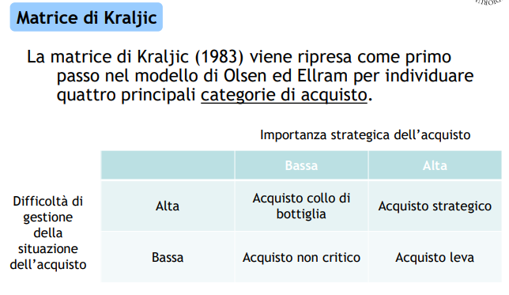
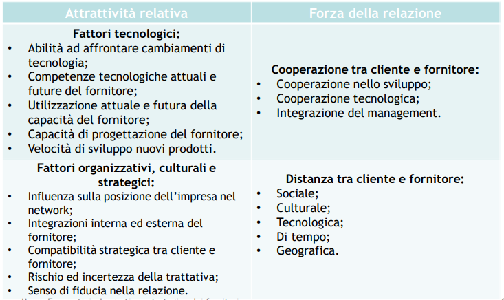
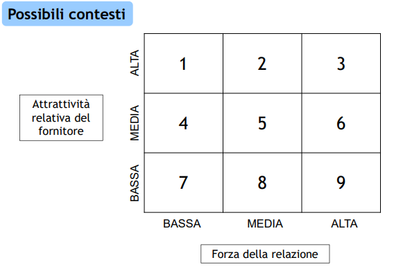

# 14 Gestione strategica dei fornitori

## Strategie di Sourcing

- **Single sourcing** - unico fornitore non monopolista

- **Sole sourcing** - unico fornitore monopolista

- **Dual sourcing** - due fonti per minimizzare il rischio

- **Multi sourcing** - più fornitori

## Il modello di Fujimoto

Risulta opportuno analizzare le relazioni tra cliente e fornitore non esclusivamente dal punto di vista del cliente, ma anche conglobando quello del fornitore.

Il modello di Fujimoto (1997) delinea quattro situazioni:

- Single sourcing da fornitore dedicato

- Single sourcing da fornitore indipendente

- Multi sourcing da fornitori dedicati

- Multi sourcing da fornitori indipendenti

**Power Matrix**

**Matrice della dipendenza tra cliente e fornitore**

Risaltano i due modelli manageriali giapponesi:

- TQM - Total Quality management: la qualità degli acquisti influenza la qualità del prodotto: stretta
  collaborazione con i fornitori, selezione e addestramento.

- JIT - Just In Time: prevede il livellamento della produzione, la sincronizzazione delle attività
  produttive ed l’eliminazione delle scorte.

## Analisi del portafoglio

**L'analisi del portafoglio dei fornitori dovrebbe seguire un approccio differenziato per tenere conto delle specifiche dei prodotti e delle dinamicità nei rapporti fornitori/clienti**

- Matrice di Kraljic - valutazione di strategie di sourcing differenziate. Focus principale: <u>categoria merceologica d’acquisto</u>

- Matrice di Olsen & Ellram - usa Kraljic per poi analizzare nel dettaglio la <u>relazione tra cliente e fornitore</u>, e suggerire raccomandazioni strategiche.
  
  1. Analisi degli acquisti con Kraljic
  
  2. Analisi delle relazioni esistenti con i fornitori
  
  3. Sviluppo di piani di azione

### Analisi degli acquisti - Matrice di Kraljic

Si classificano i prodotti acquistati:

- importanza strategica
  
  - fattori della competenza
  
  - fattori economici
  
  - fattori di immagine

- difficoltà di gestione
  
  - caratteristiche del prodotto
  
  - caratteristiche del mercato della fornitura
  
  - caratteristiche dell'ambiente

Un **acquisto leva** deve favorire entrambe le parti della relazione perché producono un alto valore per entrambi; tuttavia la disponibilità da altri fornitori è elevata ed è quindi critico tenere bassi i costi. Il cliente è in vantaggio.

Un **acquisto non critico** rappresenta l'acquisto di un prodotto di scarsa importanza, nel quale il cliente acquista "per semplicità"

Un **acquisto collo di bottiglia** è solitamente quello effettuato durante la ricerca di soluzioni alternative per la propria fornitura.

Un **acquisto strategico** vede il fornitore come "estensione naturale dell'impresa" dove il cliente cerca di coinvolgere il fornitore nello sviluppo dei prodotti.

### Modello di Olsen ed Ellram

è un modello normativo in tre step per supportare l'analisi e la gestione del portafoglio dei fornitori. L'analisi si propone di classificare l'importanza delle relazioni con determinati fornitori. **Attrattività del fornitore** e **Forza della relazione** sono i punti analizzati.

|  |  |
| ---------------------------------------------------------------------------- | -------------------------------------------- |

- **1 2 4** -> rafforzare la relazione. Spesso riferito a un acquisto strategico. Coinvolgere il fornitore nello sviluppo del prodotto. Facile rafforzamento delle relazioni senza investimento di nuove risorse per leva e non critici.

- **7 8 9** -> migliorare l'attrattività del fornitore e le prestazioni della relazione. Possibile cambio di fornitore. In caso di collo di bottiglia un cambio richiederebbe troppo tempo.

- **3 5 6** -> ridurre le risorse allocate alla relazione. Tattica di solito usata in acquisti non critici e leva.
