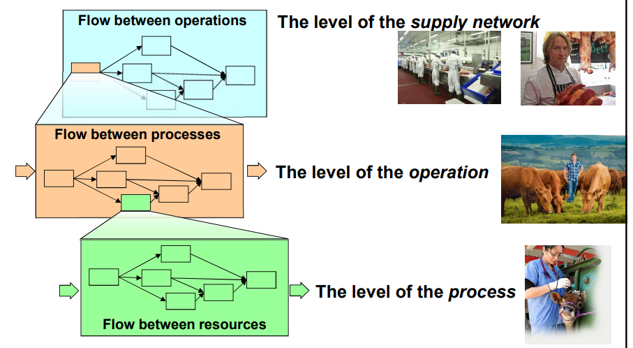
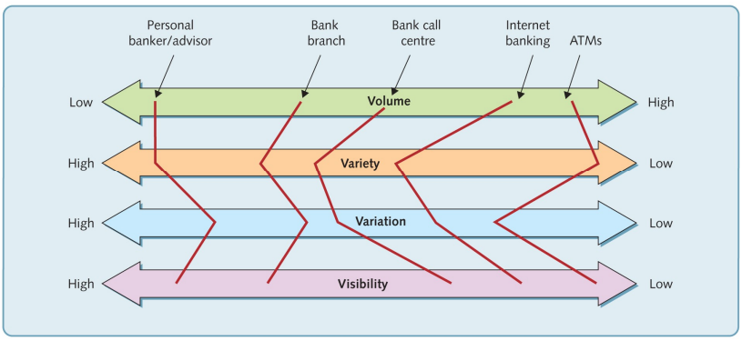

# 15 Operations Management

è la gestione di tutti i processi che portano alla creazione di valore per il cliente. In particolare ci si occupa di processi di **trasformazione**. 

Analisi esterna e interna. 

## Prodotti o Servizi?

I prodotti diventano sempre più servizi (**servitization**): ad esempio come i noleggi delle auto. I servizi a loro volta sono sempre più tangibili. (**Tangible cues**).

## Le 4 V delle tipologie di operations

- Volume
  
  - > Obiettivi diversi fra fast food e ristoranti gourmet

- Varietà
  
  - > La varietà ad esempio fra un taxi e la metro nelle destinazioni raggiungibili
  
  - mass customization, modularity

- Variazione della domanda
  
  - > La domanda è più imprevedibile per articoli sportivi o tecnologici che per il cibo come il pane. Il periodo di acquisto è anche un parametro importante.
  
  - stagionalità, trend, picco di domanda

- Visibilità
  
  - > L'esperienza cliente è diversa fra un atelier di abiti su misura e zara

*esempio nel settore bancario*

