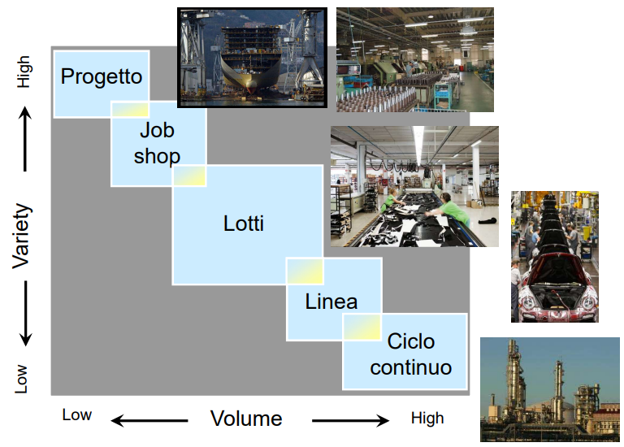

# 15 Operations Management

è la gestione di tutti i processi che portano alla creazione di valore per il cliente. In particolare ci si occupa di processi di **trasformazione**. 

Analisi esterna e interna. 

## Prodotti o Servizi?

I prodotti diventano sempre più servizi (**servitization**): ad esempio come i noleggi delle auto. I servizi a loro volta sono sempre più tangibili. (**Tangible cues**).

## Le 4 V delle tipologie di operations

- Volume
  
  - > Obiettivi diversi fra fast food e ristoranti gourmet

- Varietà
  
  - > La varietà ad esempio fra un taxi e la metro nelle destinazioni raggiungibili
  
  - mass customization, modularity

- Variazione della domanda
  
  - > La domanda è più imprevedibile per articoli sportivi o tecnologici che per il cibo come il pane. Il periodo di acquisto è anche un parametro importante.
  
  - stagionalità, trend, picco di domanda

- Visibilità
  
  - > L'esperienza cliente è diversa fra un atelier di abiti su misura e zara

*esempio nel settore bancario*

## Processi di produzione

I processi di produzione possono variare molto in base al prodotto che si vuole costruire:

### Progetto

Ha come obiettivo la produzione di un prodotto unico, che punta sulla varietà. Importante il coordinamento di risorse.

### Job Shop (produzione per reparto)

Un singolo edificio contiene tutto quello che serve per la produzione ma in piccola scala. (es. cucine su misura)

### Batch (lotti)

Il volume inizia a essere importante da richiedere dell'automazione che deve però essere flessibile nelle modifiche. Necessita un tempo di setup.

### Produzione in linea

Quando è necessario un elevato volume. Il **tempo di ciclo** da il ritmo alla linea. Flessibilità limitata.

### Produzione a ciclo continuo

Ovvero produzione a flusso continuo, spesso dettata da requisiti specifici (es. industrie chimiche).

## Layout

<da completare>
