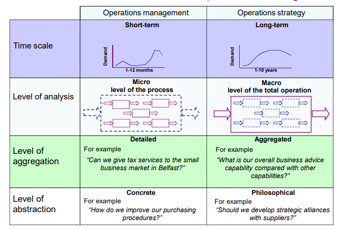

# 16 Operations Strategy

La strategia operativa si riferisce all'insieme di decisioni e azioni intraprese da un'azienda per gestire le sue risorse e i suoi processi al fine di raggiungere i suoi obiettivi aziendali complessivi. Essa implica la scelta dei prodotti o servizi da offrire, il modo migliore per produrli ed erogarli in modo efficiente e il continuo miglioramento delle operazioni per soddisfare le mutevoli esigenze dei clienti e le condizioni di mercato.

**Confronto con operations management**

## The 4 perspectives of operations strategy

- **Top-down** - analize going from the business strategy down to the operations.

- **Bottom-up** - analize from the operations level gathering informations and reporting to the development of operations strategy.

- **Operations resources perspective** - 

- **Market requirement perspective**

?? 

1. The outside-in perspective: This perspective looks at the operations function from the perspective of customers, suppliers, and other stakeholders external to the organization. It emphasizes the importance of understanding the needs and expectations of these stakeholders and aligning the operations strategy accordingly.

2. The inside-out perspective: This perspective focuses on the internal capabilities of the operations function and how they can be leveraged to create competitive advantage. It emphasizes the importance of developing unique capabilities and processes that set the organization apart from its competitors.
