# 17 La gestione della qualità e il Lean Management

Per gestire al meglio la qualità e migliorare i processi ci si deve chiedere see la qualità è definita, misurata, controllata in modo adeguato e come si identificano le cause dei problemi.

Per definire il concetto di qualità possiamo affidarci alle categorie proposte da Garvin:

- **product-based** - un insieme di determinate caratteristiche

- **manifacturing-based** - senza difetti

- **value-based** - qualità vs costo/prezzo

- **user-based** - fitness for purpose (diversi bisogni per diversi clienti)

- **trascendent** - eccellenza innata e tangibile

- **gap-based** - aspettative e percezioni; sempre tenere conto del gap fra *customer expectations* e *perception of the service*

Per misurare la qualità invece avremo bisogno di indicatori quali performance, estetica, features, conformità a norme, affidabilità durabilità, qualità percepita e servizi connessi.

**Qualità** è quindi la totalità delle specifiche e delle caratteristiche di un prodotto o servizio su cui si basa la sua abilità di soddisfare determinati bisogni.

La certificazione **Qualità ISO 9001** è uno standard internazionale applicabile a qualsiasi settore produttivo. è basata su 8 principi di gestione (come ad esempio la focalizzazione sul cliente, una buona leadership, un miglioramento continuo nei processi, una buona gestione dei lavoratori...).

Ritorna il concetto di **gap** che costituisce un parametro per trovare punti di miglioramento:

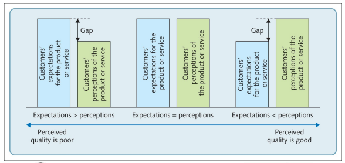

**ServQual** modella il gap sulla qualità fra quella aspettata e quella percepita.

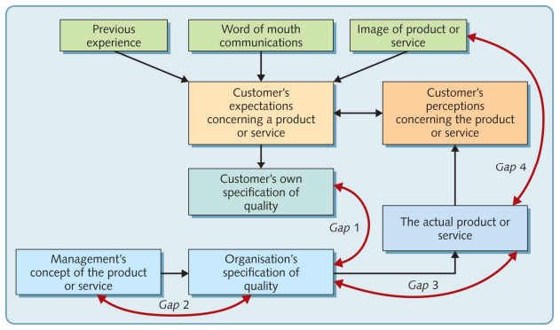

## Obiettivi

Il problema rimane quello di avere una misurazione oggettiva o soggettiva a seconda del parametro da analizzare.

Gli **obiettivi** da definire possono essere divisi in:

- ob. basati su dati storici

- ob. strategici

- ob. basati su performance esterne

- ob. di performance assoluta

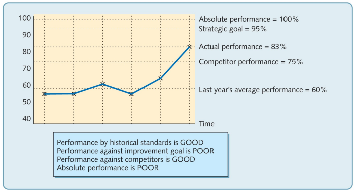

## Costi

I **costi** della qualità:

- Prevention cost - costi per prevenire errori

- Appraisal cost - coosti dei controllo qualità

- Internal failure cost - costi di errori interni al processo

- External failure cost - costi provocati dai consumatori

Il grafico qui sotto mostra la quantità di sforzi da dedicare alla qualità.

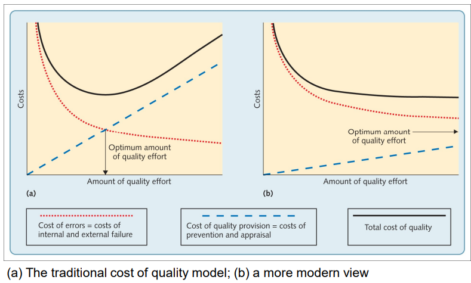

*Il costo della qualità è sempre più alto perché la tecnologia e la globalizzazione hanno incrementato la complessità di prodotti e servizi, aumentando però anche le aspettative dei consumatori. Quality provision ha costi più alti per assicurare maggiori livelli di qualità, tuttavia un errore è più significativo che in passato*

Il **modello a cono di sabbia** suggerisce che una riduzione dei costi è data da basi solide di altri obiettivi, qualità in pirmis.

## Controllo

Vogliamo degli strumenti per monitorare la qualità dei nostri processi. Il **Six Sigma** analizza questi al fine di diminuire difetti e variazioni. Sfrutta strumenti statistici per eliminare fonti di variabilità.

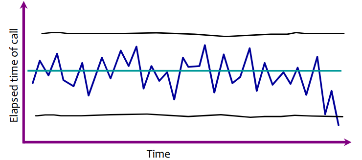

Spesso la variazione naturale dei processi segue una **distribuzione normale**. Questo aiuta a mostrare i picchi e le variazioni che effettivamente indicano un problema.

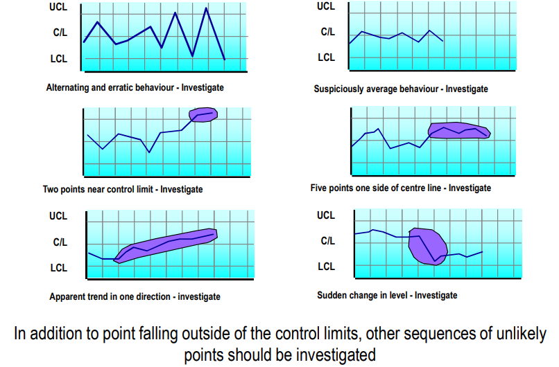

## Approcci

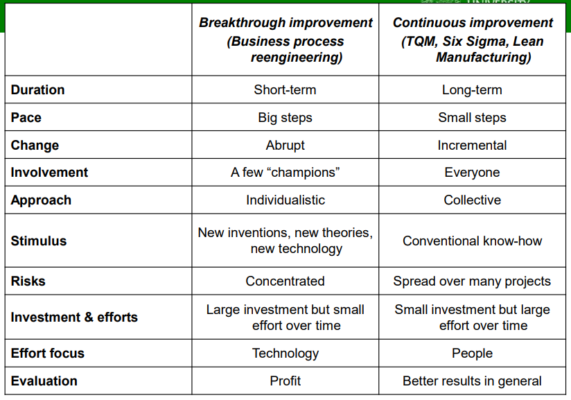

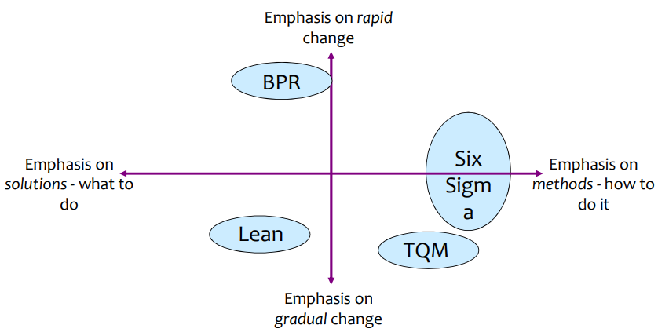

TQM -> how and gradual

Business Process Reengineering -> cambiamenti discontinui e rapidi

Lean -> how with gradual change

## Lean Management

ha come obiettivo principale quello di andare a rimuovere gli sprechi nei nostri processi.

Un esempio è rappresentato dalla **Just-In-Time (Heijunka) production** che consiste nel costruire solo le cose che sono state effettivamente ordinate.

Il caso Toyota è quello che più rappresenta un lean management. Le filosofie che rappresenta sono:

- Eliminazione degli sprechi

- Rispetto per le persone

Inoltre ogni stazione di montaggio nella linea di produzione è essa stessa un controllo qualità che può intervenire per risolvere problemi di piccola entità al momento.

## Ridurre lo spreco

**Le 7 forme di spreco**

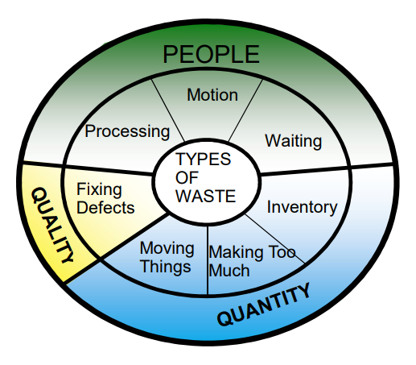

Per ridurre lo spreco possiamo adottare diverse tecniche:

1. Value Stream Mapping - un flow chart per scoprire ed eliminare le NVA. Sfrutta l'indicatore *Process Efficiency* (VA time/total time)
   
   1. Value added - necessarie e volute
   
   2. Non-value added - non necessarie e non volute
   
   3. Business non-value added - necessarie e non volute

2. 5S - praticamente migliorare l'ambiente di lavoro (zone pulite)
   
   1. Sorting
   
   2. Set in order
   
   3. Sweeping
   
   4. Standardization
   
   5. Self-Discipline

## Just-In-Time

Ovvero sincronizzare il processo di produzione con la domanda del prodotto.

1. produrre al rateo della domanda del consumatore
   
   1.  piccole batch e riduzione del tempo/costo di setup. Procedura **SMED**, ovvero spostare gli strumenti per ottimizzare.

2. usare un sistema pull (produzione su domanda) e non push (produzione su previsione)
   
   1. Kanban metodology
   
   2. Un buffer di magazzino più piccolo espone prima eventuali difetti

## Lean manufacturing

1. Cellular Layout

| 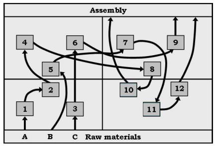 | 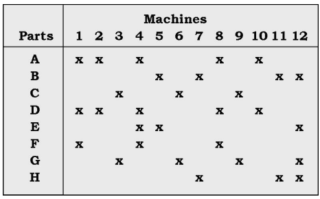 | 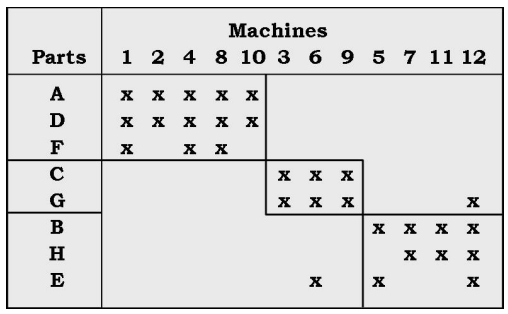 | 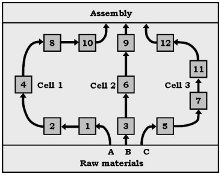 |
| -------------------------------------------- | -------------------------------------------- | -------------------------------------------- | -------------------------------------------- |

2. Demand Pull - gli output diventano il trigger per l'inizio del processo

3. Level Production - i diversi prodotti sono alternati spesso

4. Quality at the source - prima vedi un difetto meno ti costa

5. Standardization of Work and Maintenance

6. Use Safety Capacity - instead of safety inventory

7. Improving Performance Visibility

8. Employee Involvement

9. Supplier Management
