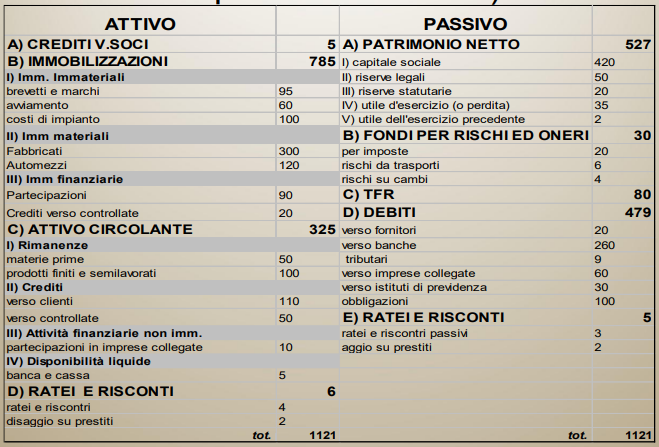

# Bilancio Aziendale e Indici

Il bilnacio di esercizio è obbligatorio per le società di capitali. Per le società di persone invece, se sotto certi limiti, viene effettuato un bilancio sempificato.

Il bilancio d'esercizio è composto da 4 parti:

- Stato Patrimoniale (SP) - art. 2424 cc
- Conto Economico (CE) - art. 2425 cc
- Nota Integrativa - art. 2427 cc
- Relazione sulla gestione - art. 2428 cc

## Stato Patrimoniale

**Forma:** a sezione contrapposte (attivo e passivo)

### Ratei e risconti

Rappresentano costi e ricavi la cui competenza e riferita a più esercizi (anni di bilancio). Si registrano durante le scritture di assestamento (fine anno).

## Conto Economico

**Forma:** scalare (costi e ricavi)

## Nota Integrativa

**Forma:** testuale

## Analisi del bilancio

Consiste nello studiare il bilancio mediante la scomposizione del sistema unitario del valore in parti più semplici, per poterle analizzare e confrontare.

Procedimento:

1. Riclassificare i dati del bilancio
2. Attuare correlazioni tra valori
3. Comporre rapporti tra valori
4. Strutturare serie di valori ed attuare l'analisi

### Alcune definizioni

**Valore della produzione:** ricchezza creata dall'azienda durante l'esercizio

**Prodotto d'esercizio:** ricchezza al lordo dei fattori che hanno concorso alla sua produzione

**Valore aggiunto:** ricchezza creata dall'azienda durante l'esercizio, al netto dei fattori che hanno concorso alla sua produzione

### Tipi di Analisi

- Strutturale
- Per indici
- Per flussi

#### Margine di Tesoreria

> Margine di Tesoreria = Liquidità immediate + Liqudità differite - Passività correnti

Se è **positivo** l'azienda è in grado di far fronte ai debiti a breve termine.

#### Margine di Struttura

> Margine di Struttura [Primario] = Capitale (o Patrimonio) netto - Immobilizzazioni nette

Se è **positivo** l'azienda copre con il Patrimonio Netto le immobilizzazioni.

|  |  |
| -------------------------------------------- | -------------------------------------------- |

#### Matrice dei margini

### Capitale circolante

Il capitale circolante è la somma algebrica di ritardi e risparmi in termini di tempo di un ciclo di produzione. (dal pagamento dei fornitori all'incasso dei clienti)

> Capitale circolante netto (CCN) = Attivo corrente (crediti) - Passivo corrente (debiti)

Se è **positivo** le AC sono finanziate anche da debiti M/l termine, situazione favorevole. Al contrario se è **negativo** le AC sono finanziate da debiti a breve termine, situazione pericolosa.

### Profili di analisi

#### Equilibrio di breve periodo

L'obiettivo di questa analisi è quello di valutare la capacità dell'azienda di far fronte ai debiti a breve termine (fornitori).

> Rapporto corrente = (Attivo circolante [SP] - rimanenze) / Debiti [SP]
> 
> Rapporto di liquidità = Attivo circolante [SP] / Debiti [SP]
> 
> Tempo medio di incasso (TMI) = crediti v/clienti [SP sez.C] / ricavi di vendita [CE sez. A] \* 365
> 
> Tempo medio di pagamento (TMP) = debiti v/fornitori [SP sez. D] / costi per materie prime [CE sez. B] \* 365
> 
> Tempo medio di giacenza delle scorte (TMGS) = scorte [CE variazioni] / costi per materie prime [CE sez. B] \* 365
> 
> **Ciclo del circolante = TMI - TMP + TMGS**

Il ciclo del circolante indica il tempo medio fra il pagamento di un fornitore e l'incasso di un credito.

#### Equilibrio di lungo periodo

L'obiettivo di questa analisi è quello di valutare la capacità dell'azienda di far fronte ai debiti a lungo termine (investimenti e finanziamenti).

> Rapporto di indebitamento = Debiti [SP sez. D] / Debiti [SP sez. D] + Patrimonio netto [SP sez. A]
> 
> _Dipendenza da terzi_

> Copertura degli oneri finanziari = Reddito Operativo [CE ric.] / Oneri Finanziari [CE sez. 2]
> 
> _Se inferiore a 1, la gestione caratteristica potrebbe non coprire gli oneri_

> Quoziente di copertura delle immobilizzazioni = Attività consolidate [es. immobilizzazioni SP ric.] / (Passività consolidate [es. debiti > 12 mesi SP] + Capitale Proprio [ex Patrimonio Netto SP ric.])
> 
> _Se maggiore di 1 indica che l'attivo immobilizzato è finanziato da passività con scadenza nell'esercizio_

> Rapporto tra debiti a B termine e a M/L termine = Debiti a breve [SP sez. D] / Debiti M/L [SP sez. D + E]

> Onerosità media dell'indebitamento = Oneri Finanziari [CE sez. 2] / Debiti Finanziari [SP banche e obbligazioni]
> 
> _Esprime il costo medio dei finanziamenti_

#### Redditività e produttività

Ovvero la capacità di un'azienda di generare ricchezza, calcolata sulla riclassificazione del CE.

> Return On Equity (ROE) = Reddito d'Esrcizio (Utile) [CE ric.] / Patrimonio Netto [SP sez. A] \* 100
> 
> _Indica quanto il capitale investito ha effetto sull'azienda, rendimento del capitale proprio_

> Return On Investment (ROI) = Reddito Operativo [CE ric.] / Totale Attivo [Impieghi SP ric.] \* 100
> _Indica quanto gli investimenti effettuati siano in grado di generare reddito_

> Return On Sales (ROS) = Reddito Operativo [CE ric.] / Ricavi di vendita [CE sez. A] \* 100
> 
> _Indica la redditività delle vendite. Il reddito operativo deve essere in grado di ripagare almeno gli interessi passivi._

> Tasso di rotazione del capitale investito = ROI / ROS
> 
> _Indica il numero di volte in cui il capitale investito nella gestione tipica torna come liquidità attraverso le vendite. è un numero_

#### Composizione dell'attivo

> Grado di ammortamento delle immobilizzazioni tecniche = Fondi di ammortamento / Immobilizzazioni tecniche \* 100
> 
> _Esprime la quota di immobilizzazioni tecniche recuperate dal capitale investito_

> Tasso di sviluppo delle immobilizzazioni tecniche = Investimenti tecnici dell'esercizio / Immobilizzazioni presenti all'inizio dell'esercizio \* 100

### Valutazione del rischio di impresa

- **RISCHIO OPERATIVO** collegato alla gestione caratteristica dell’impresa
- **RISCHIO FINANZIARIO** derivante dal tipo di fonti (passività) che finanziano gli impieghi (attività) dell’impresa

Il loro prodotto costituisce il **rischio complessivo**

> Leva Operativa = Margine di Contribuzione / Reddito Operativo
> 
> _Una leva operativa elevata indica un'elevata di incidenza di costi fissi e una pericolosa elasticità del RO all variare delle vendite. Se la leva è negativa l'azienda è a rischio di fallimento._

