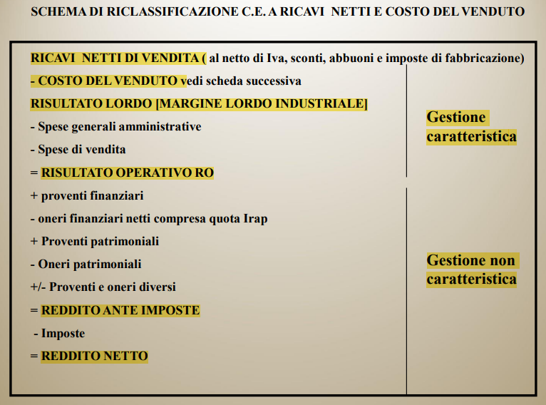

# Bilancio Aziendale e Indici

Il bilancio d'esercizio è obbligatorio per le società di capitali. Per le società di persone invece, se sotto certi limiti, viene effettuato un bilancio sempificato.

Il bilancio d'esercizio è composto da 4 parti:

- Stato Patrimoniale (SP) - art. 2424 cc
- Conto Economico (CE) - art. 2425 cc
- Nota Integrativa - art. 2427 cc
- Relazione sulla gestione - art. 2428 cc

## Stato Patrimoniale

**Forma:** a sezione contrapposte (attivo e passivo)

### Ratei e risconti

Rappresentano costi e ricavi la cui competenza e riferita a più esercizi (anni di bilancio). Si registrano durante le scritture di assestamento (fine anno).

## Conto Economico

**Forma:** scalare (costi e ricavi)

## Nota Integrativa

**Forma:** testuale

## Analisi del bilancio

Consiste nello studiare il bilancio mediante la scomposizione del sistema unitario del valore in parti più semplici, per poterle analizzare e confrontare.

Procedimento:

1. Riclassificare i dati del bilancio
2. Attuare correlazioni tra valori
3. Comporre rapporti tra valori
4. Strutturare serie di valori ed attuare l'analisi

### Alcune definizioni

**Valore della produzione:** ricchezza creata dall'azienda durante l'esercizio

**Prodotto d'esercizio:** ricchezza al lordo dei fattori che hanno concorso alla sua produzione

**Valore aggiunto:** ricchezza creata dall'azienda durante l'esercizio, al netto dei fattori che hanno concorso alla sua produzione

### Tipi di Analisi

- Strutturale
- Per indici
- Per flussi

#### Margine di Tesoreria

> Margine di Tesoreria = Liquidità immediate + Liqudità differite - Passività correnti

Se è **positivo** l'azienda è in grado di far fronte ai debiti a breve termine.

#### Margine di Struttura

> Margine di Struttura [Primario] = Capitale (o Patrimonio) netto - Immobilizzazioni nette

Se è **positivo** l'azienda copre con il Patrimonio Netto le immobilizzazioni.

|  |  |
| -------------------------------------------- | -------------------------------------------- |

#### Matrice dei margini

### Capitale circolante

Il capitale circolante è la somma algebrica di ritardi e risparmi in termini di tempo di un ciclo di produzione. (dal pagamento dei fornitori all'incasso dei clienti)

> Capitale circolante netto (CCN) = Attivo corrente (crediti) - Passivo corrente (debiti)

Se è **positivo** le AC sono finanziate anche da debiti M/l termine, situazione favorevole. Al contrario se è **negativo** le AC sono finanziate da debiti a breve termine, situazione pericolosa.

### Profili di analisi

#### Equilibrio di breve periodo

L'obiettivo di questa analisi è quello di valutare la capacità dell'azienda di far fronte ai debiti a breve termine (fornitori).

> Rapporto corrente = (Attivo circolante [SP] - rimanenze) / Debiti [SP]
>
> Rapporto di liquidità = Attivo circolante [SP] / Debiti [SP]
>
> Tempo medio di incasso (TMI) = crediti v/clienti [SP sez.C] / ricavi di vendita [CE sez. A] \* 365
>
> Tempo medio di pagamento (TMP) = debiti v/fornitori [SP sez. D] / costi per materie prime [CE sez. B] \* 365
>
> Tempo medio di giacenza delle scorte (TMGS) = scorte [CE variazioni] / costi per materie prime [CE sez. B] \* 365
>
> **Ciclo del circolante = TMI - TMP + TMGS**

Il ciclo del circolante indica il tempo medio fra il pagamento di un fornitore e l'incasso di un credito.

#### Equilibrio di lungo periodo

L'obiettivo di questa analisi è quello di valutare la capacità dell'azienda di far fronte ai debiti a lungo termine (investimenti e finanziamenti).

> Rapporto di indebitamento = Debiti [SP sez. D] / Debiti [SP sez. D] + Patrimonio netto [SP sez. A]
>
> _Dipendenza da terzi_

> Copertura degli oneri finanziari = Reddito Operativo [CE ric.] / Oneri Finanziari [CE sez. 2]
>
> _Se inferiore a 1, la gestione caratteristica potrebbe non coprire gli oneri_

> Quoziente di copertura delle immobilizzazioni = Attività consolidate [es. immobilizzazioni SP ric.] / (Passività consolidate [es. debiti > 12 mesi SP] + Capitale Proprio [ex Patrimonio Netto SP ric.])
>
> _Se maggiore di 1 indica che l'attivo immobilizzato è finanziato da passività con scadenza nell'esercizio_

> Rapporto tra debiti a B termine e a M/L termine = Debiti a breve [SP sez. D] / Debiti M/L [SP sez. D + E]

> Onerosità media dell'indebitamento = Oneri Finanziari [CE sez. 2] / Debiti Finanziari [SP banche e obbligazioni]
>
> _Esprime il costo medio dei finanziamenti_

#### Redditività e produttività

Ovvero la capacità di un'azienda di generare ricchezza, calcolata sulla riclassificazione del CE.

> Return On Equity (ROE) = Reddito d'Esrcizio (Utile) [CE ric.] / Patrimonio Netto [SP sez. A] \* 100
>
> _Indica quanto il capitale investito ha effetto sull'azienda, rendimento del capitale proprio_

> Return On Investment (ROI) = Reddito Operativo [CE ric.] / Totale Attivo [Impieghi SP ric.] \* 100
> _Indica quanto gli investimenti effettuati siano in grado di generare reddito_

> Return On Sales (ROS) = Reddito Operativo [CE ric.] / Ricavi di vendita [CE sez. A] \* 100
>
> _Indica la redditività delle vendite. Il reddito operativo deve essere in grado di ripagare almeno gli interessi passivi._

> Tasso di rotazione del capitale investito = ROI / ROS
>
> _Indica il numero di volte in cui il capitale investito nella gestione tipica torna come liquidità attraverso le vendite. è un numero_

#### Composizione dell'attivo

> Grado di ammortamento delle immobilizzazioni tecniche = Fondi di ammortamento / Immobilizzazioni tecniche \* 100
>
> _Esprime la quota di immobilizzazioni tecniche recuperate dal capitale investito_

> Tasso di sviluppo delle immobilizzazioni tecniche = Investimenti tecnici dell'esercizio / Immobilizzazioni presenti all'inizio dell'esercizio \* 100

### Valutazione del rischio di impresa

- **RISCHIO OPERATIVO** collegato alla gestione caratteristica dell’impresa
- **RISCHIO FINANZIARIO** derivante dal tipo di fonti (passività) che finanziano gli impieghi (attività) dell’impresa

Il loro prodotto costituisce il **rischio complessivo**

> Leva Operativa = Margine di Contribuzione / Reddito Operativo
>
> _Una leva operativa elevata indica un'elevata di incidenza di costi fissi e una pericolosa elasticità del RO all variare delle vendite. Se la leva è negativa l'azienda è a rischio di fallimento._

### Discount Cash Flow Analysis

#### WACC e Beta caratteristico

Il WACC (Weighted Average Cost of Capital) è il costo medio ponderato del capitale. È un tasso, la cui formula permette di calcolare il costo del capitale di un’impresa, ovvero il tasso al quale l’azienda deve remunerare i suoi finanziatori (azionisti, detentori di titoli di debito).

$$
WACC =  k_d \cdot (1 - t) \cdot \frac{D}{E + D} + k_e \cdot \frac{E}{E + D}
$$

> - $k_d \cdot (1-t)$ = costo del debito al netto della fiscalità (ovvero tasso di interesse al netto della deducibilità fiscale degli interessi passivi)
> - $D$ = valore del debito gravato da interessi
> - $E$ = valore dell’Equity (patrimonio netto)
> - $k_e$ = costo del capitale proprio o di rischio

$$
k_e = r_f + \beta (r_m - r_f)
$$

> - $r_f$ è il tasso di interesse di un titolo privo di rischio (es. BTP decennale)
> - $\beta$ è la misura del rischio teorico di un titolo azionario rapportato all’intero mercato (dato da un indice come il Mibtel)
> - $r_m - r_f$ è il premio per il rischio di mercato (perché si investe in azioni e non in titoli privi di rischio)

- Beta < 1 : il titolo segue il mercato ma con una volatilità inferiore, rischio minore
- Beta = 1 : il titolo segue il mercato
- Beta > 1 : il titolo segue il mercato ma con una volatilità superiore, rischio maggiore
- Beta <= 0 : il titolo non segue il mercato o va in direzione opposta

Il Beta può essere calcolato (covarianza mercato/azienda diviso varianza del mercato) oppure si può utilizzare il Beta caratteristico di un settore (**Beta di settore**) o ancora di società simili sul mercato (**shadow Beta**).

Con **unlevered Beta** si intende il Beta di un'azienda che prende in esame solo i rischi dell'attività produttiva. Moltiplicando per il premio del rischio finanziario si ottiene il **levered Beta**.

### Valutazioni sugli investimenti aziendali

Un investimento è un impegno di risorse monetarie di lungo periodo per il quale si ipotizza:

- il recupero del denaro inizialmente investito (recupero dell’investimento)
- un rendimento sulla somma investita adeguato alla durata e al rischio dell’operazione (ritorno dell’investimento)

I **prezzi ombra** rappresentano il valore marginale di un fattore di produzione o di consumo, ovvero l'incremento del valore di un'attività o di un bene che si ottiene aumentando l'unità di quel fattore di produzione o di consumo di una quantità infinitesimale.

La domanda che bisogna porsi prima di fare un investimento è: _l'entrata di cassa che l’investimento prospetta è sufficiente a giustificare l’esborso iniziale?_

Il termine **prestito** in economia indica la cessione di una somma di denaro con il vincolo della restituzione di capitali di pari valore o maggiori (capitale + interessi).

Elementi costitutivi di un prestito sono:

- Il capitale finanziato
- Il tasso di interesse
- La durata del prestito
- L'importo e la periodicità delle rate

Il processo di attualizzazione (o sconto) è il processo inverso della capitalizzazione, ovvero il processo che permette di calcolare il valore attuale di un capitale futuro.

> Ad esempio, se una persona ha la possibilità di ricevere $1000 tra un anno, e il tasso di interesse attuale è del 5%, il valore attuale di quei $1000 sarà inferiore a $1000, perché la persona potrebbe investire quei soldi oggi e guadagnare interesse. Il valore attuale dei $1000 sarà quindi pari a $952.38 (cioè $1000 diviso per 1.05, che rappresenta il fattore di sconto).

Tuttavia il processo di attualizzazione non è sempre così semplice, perché il tasso di interesse può variare nel tempo.

Tasso di interesse semplice: il tasso di interesse si applica solo sul capitale iniziale. [$V = C \cdot (1 + i \cdot n)$]

Tasso di interesse composto: il tasso di interesse si applica anche sugli interessi maturati. [$V = C \cdot (1 + i)^n$]

**Montante capitalizzato su più anni**

$M = C \cdot (1 + i)^n$

> Capitale iniziale = 1.000, tasso di interesse = 5%
>
> Montante dopo 10 anni = $1.000 \cdot (1 + 0.05)^{10} = 1.628$

**Valore attuale di un capitale futuro**

$V =  \frac{M}{(1 + i)^n}$

> Incasso di 25.000 tra 5 anni, tasso di interesse 7%
>
> Valore attuale = $V = \frac{25.000}{(1 + 0.07)^{5}} = 9.061,10$

Il valore attuale di una serie di flussi di cassa (benefici-costi) rappresenta il valore presente dei flussi di cassa futuri generati da un progetto o da un investimento, tenendo conto dei costi e dei benefici associati a tale progetto o investimento. Consiste nel calcolo del valore attuale di ogni flusso di cassa futuro, sommando poi i valori ottenuti.

#### Valore attuale netto (VAN)

Il VAN è una metodologia tramite cui si definisce il valore di una serie attesa di flussi di cassa (benefici-costi) attesi al netto dell’esborso iniziale.

In pratica, il VAN rappresenta la differenza tra il valore attuale dei flussi di cassa in entrata e il valore attuale dei flussi di cassa in uscita, calcolati utilizzando un tasso di sconto appropriato. Un **valore positivo** del VAN indica che l'**investimento è conveniente**, mentre un valore negativo indica che l'investimento non è conveniente.

La formula del Valore Attuale Netto è la seguente:

$$
VAN = \sum_{t=0}^{n} \frac{R_t}{(1+i)^t} - \sum_{t=0}^{n} \frac{C_t}{(1+i)^t}
$$

dove:

- _R_t_ rappresenta il flusso di cassa in entrata (ovvero il ricavo) nel periodo t
- _C_t_ rappresenta il flusso di cassa in uscita (ovvero il costo) nel periodo t
- _i_ rappresenta il tasso di sconto utilizzato per attualizzare i flussi di cassa
- _n_ rappresenta l'ultimo periodo in cui si verifica un flusso di cassa.

Semplificando la sommatoria di C_t si può sostituire con $I$ ovvero l'investimento iniziale.

#### Tasso interno di rendimento (TIR)

Il TIR è il tasso di sconto che rende il VAN uguale a zero. In altre parole, il TIR è il tasso di sconto che rende il valore attuale dei flussi di cassa in entrata uguale al valore attuale dei flussi di cassa in uscita.

TIR > costo opportunità del capitale -> VAN > 0 il progetto è economicamente conveniente
