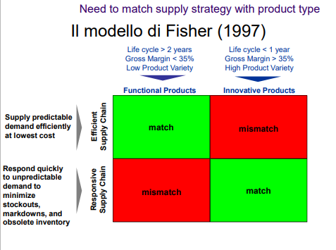

# La Gestione Strategica delle supply chain

## Introduzione

Il supply chain management ha 3+1 fasi principali:

1. Source (procurement)
2. Make (operations)
3. Deliver (logistics)
4. Return (reverse logistics)

Il supply chain management è un processo di gestione che si occupa di coordinare e integrare le attività di sourcing, procurement, conversione e logistica, in modo da creare valore per il cliente e per l'azienda. Non è quindi solo una gestione logistica.

Sono **attori** della supply chain non solo i produttori ma anche i fornitori, i distributori, i rivenditori, i clienti e i clienti dei clienti.

Anche i **flussi di informazioni e finanziari** sono importanti nella supply chain.

**Supply Network** è un insieme di supply chain interconnesse.

Il lato fornitori viene detto **upstream**, il lato clienti **downstream**.

Quando di parla di **Second Tier Supplier** si intende il fornitore del fornitore. Su di esso non si ha controllo diretto e la comunicazione è molto complessa.

> DELL ad esempio ha 4 differenti supply chain:
>
> 1. Built to order -> pc custom per cliente spesso da un e-commemrce
> 2. Built to plan -> pc per rivenditori con poche configurazioni
> 3. Built to stock -> pc con poche configurazioni ma pronti in magazzino
> 4. Built to spec -> pc per aziende con configurazioni specifiche

## Supply Chain strategy and Dynamics

Le tecniche di SCM si sviluppano principalmente su:

- global optimization
- managing uncertainty

### Tools and Strategies for Optimization

- Decision support systems
- Inventory Control
- Network Design
- Design for Logistics
- Cross Docking

Ottimizzare è difficile perché ci sono molti fattori da considerare (acquisti, produzione, magazzino, clienti) e spesso sono in conflitto tra loro.

### Bullwhip Effect

Il **bullwhip effect** (effetto frusta, in italiano) è un fenomeno che si verifica nella gestione della catena di approvvigionamento (supply chain) dove piccole variazioni nella domanda di un prodotto da parte dei consumatori possono causare grandi fluttuazioni nella domanda per i produttori di quel prodotto, lungo tutta la catena di approvvigionamento.

In altre parole, quando ci sono delle fluttuazioni nella domanda di un prodotto, queste fluttuazioni si amplificano lungo la catena di approvvigionamento, diventando sempre più grandi man mano che si avvicinano al produttore finale. Ad esempio, se un negozio al dettaglio ordina una quantità maggiore di un prodotto rispetto al solito a causa di un aumento della domanda da parte dei consumatori, il fornitore del negozio potrebbe ordinare una quantità ancora maggiore dal produttore, anche se la domanda effettiva del prodotto non è aumentata in modo significativo. Questo può causare un sovraccarico nella produzione, un eccesso di inventario e sprechi lungo la catena di approvvigionamento.

La causa principale è la **mancata comunicazione** tra i vari attori della supply chain.

È essenziale fare un **pull** delle informazioni del mercato.

Alcune contromisure sono:

- E-commerce: migliore visione della domanda
- Express delivery: riduce i tempi variazione della domanda
- Collaborative planning, forecasting and replenishment (CPFR) : condivisione delle informazioni tra i vari attori della supply chain
- Vendor managed inventory (VMI): il fornitore gestisce l'inventario del cliente
- Supply contracts: contratti di fornitura che vincolano il cliente a comprare una certa quantità di prodotto

### Functional Products vs Innovative Products

I prodotti innovativi sono quelli che hanno un ciclo di vita breve e che hanno un alto margine di profitto. I prodotti funzionali sono quelli che hanno un ciclo di vita lungo e che hanno un basso margine di profitto.

## Supply Chain Design: Fisher Model

_$\uparrow$ Un prodotto funzionale dovrebbe puntare a un processo efficiente fornendo il prodotto a un costo basso. Un prodotto innovativo invece si deve concentrare sulla velocità di consegna per soddisfare la domanda._

Il modello di Fisher è un modello di supply chain design che si basa sul ciclo di vita del prodotto.

- Physical Efficient Process: Lean
- Market Responsive Process: Agile

Lean e Agile possono essere combinati tramite tecniche come modularità, postponement e mass customization.
