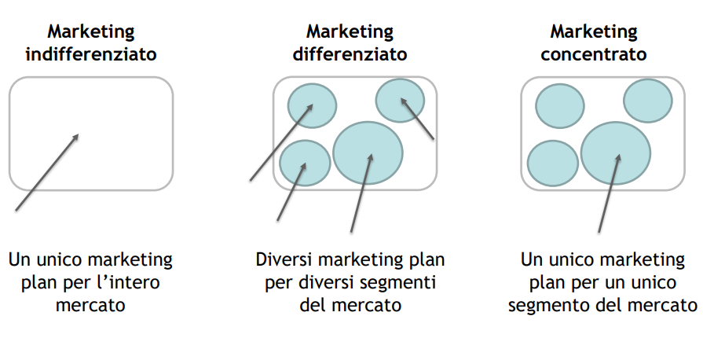
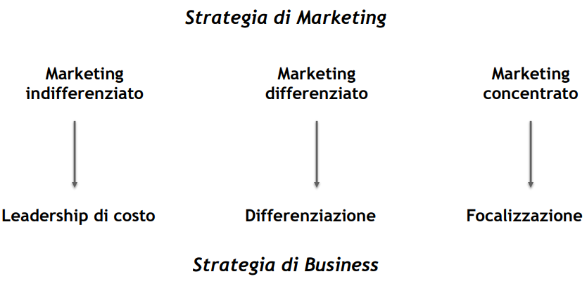
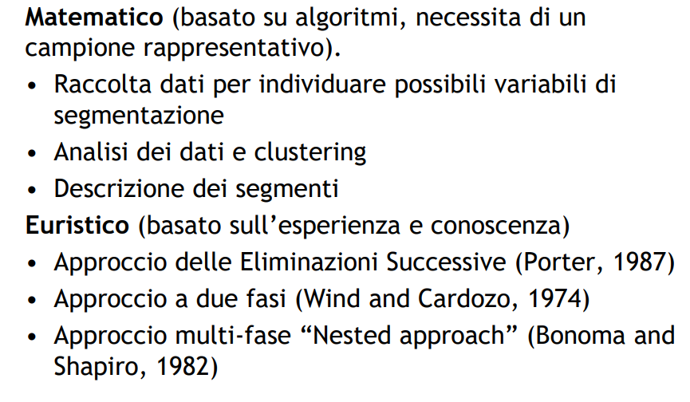

# Segmentazione

**Segmentazione del mercato** - divisione del mercato in gruppi acquirenti ben distinti con bisogni, caratteristiche  e comportamenti diifferenti.

**Targeting** - valutazione dell'attrattività di un determinato segmento di mercato.

**Positioning** - attività per occupare una posizione chiara rispetto ai concorrenti nei consumatori.

**Marketing mix** - decisione delle leve appropriate di prezzo, prodotto, distribuzione (place), promozione (4Ps).

La segmentazione è un trade-off tra due approcci opposti: Taylor-like, dove si parla di **mass marketing**, nel quale il prodotto è uno per tutti i clienti. Abbiamo poi i prodotti su misura dove ogni cliente è un mercato, e viene descritto come **marketing one-to-one**. 

Attravero la segmentazione si cerca di produrre un prodotto simile ma adatto a diverse esigenze, ad esempio con i gusti di CocaCola.

**Vantaggi**

- riduce la diversità

- migliore allocazione risorse

- barriere d'entrata per i competitor

- migliore soddisfazione del cliente

- minori rischi

**Svantaggi**

- maggiori costi

- ridondanza delle strutture organizzative

- minore economie di scala

> Aspetti migliorabili con **standardizzazione e modularizzazione**, es Ikea

**Caratteristiche**

- misurabilità

- accessibilità

- omogeneità/eterogeneità

- importanza

- durata

Per entrare in un mercato è necessario individuare le variabili di segmentazione corrette per rispondere alle esigenze dei clienti.

1. Ford model T 

2. Tipico dei grandi gruppi

3. Etsy

> Nel contesto B2B può accadere un cliente di una certa rilevanza possa essere considerato un unico segmento.

## Tecniche di segmentazione

1. In passato si utilizzava la segmentazione per prodotto. Ad oggi la segmentazione è per clienti.

2. Il metodo di segmentazione può essere **matematico** o **euristico**. 

3. Viene poi fatta un analisi dei segmenti.

### Approccio a due fasi

1. Macro-segmentazione - basata su caratteristiche esterne e situazioni di acquisto

2. Micro-segmentazione - basata sull'individuo

### Approccio multi-fase

Più ci si muove verso il centro [quadrati concentrici], più sarà difficile reperire le informazioni

demographic -> operational -> buying -> situational -> personal

### Segmentazione con il metodo delle eliminazioni successive

- metodo euristico

- qualitativo, iterativo

- uso di basi di segmentazione per creare matrici mercati/prodotti

- si eliminano quelli meno interessanti
1. si estraggono le variabili principali da una checklist

2. vengono esplorate nuove variabili

3. le variabili sono confrontate a coppie, eliminando gli incroci
