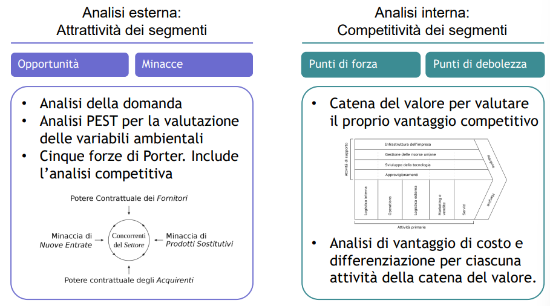
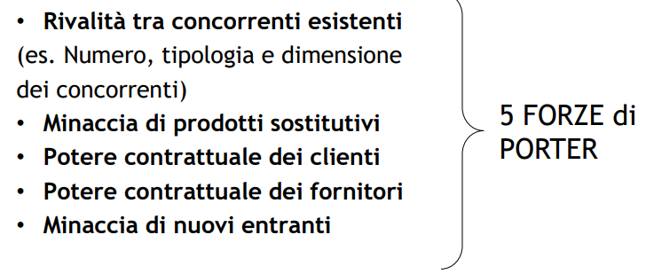
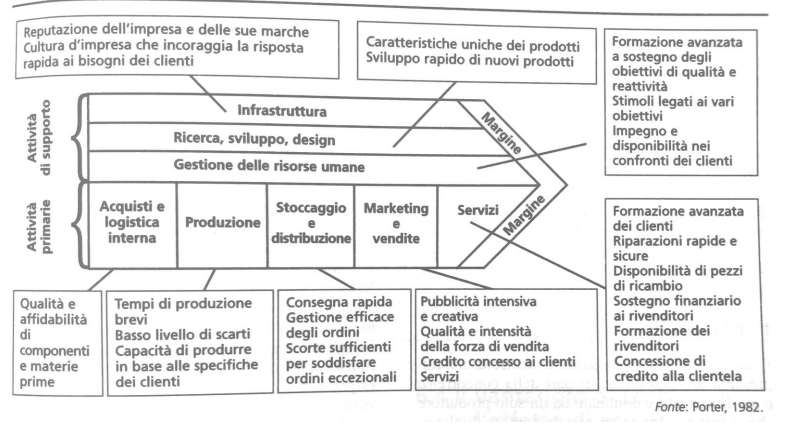
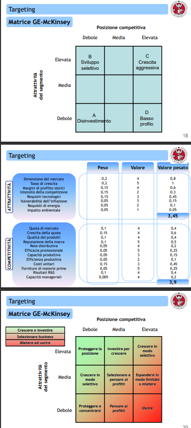
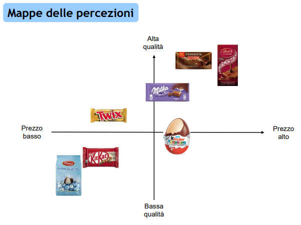
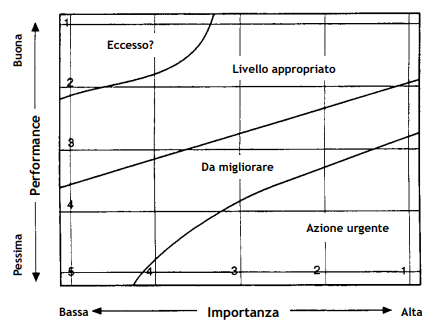

# Targeting and Positioning

## Targeting

Dopo aver segmentato il mercato bisogna individuare il **target** in cui concentrare i propri sforzi.

### Analisi SWOT

Essa fornisce informazioni riguardo sia la competitività (contesto interno) che l'attrattività (contesto esterno). [**strengths**, **weaknesses**, **opportunities**, **threats**]

Essa può risultare da attività di brainstorming ma è preferibilie usare modelli strutturati: 

- SW -> catena del valore, vantaggio di costo e differenziazione

- OT -> analisi domanda, PEST, Porter

**Analisi domanda**: somma di quantità acquistate in un certo periodo

**PESTLE**: analisi politica, economica, sociale, tecnologica, legale ed ecologica

### Matrice GE-McKinsey

Serve a individuare i target in cui posizionare i propri segmenti target

- Attrattività e competitività sono i due assi della matrice

- 9 caselle, a ciascuna è assegnato un comportamento strategico ottimale

- Il posizionamento nella matrice viene effettuato attraverso la valutazione 
  ponderata di un determinato numero di fattori

## Positioning

Come devo competere all'interno del segmento scelto?

### Mappa delle percezioni

Permette di individuare il posizionamento del prodotto secondo gli occhi del cliente.

### Importance-Performance Matrix

### Analisi degli scostamenti nelle percezioni (Gap)

Obiettivo: ridurre la progressiva deformazione delle percezioni all’interno della filiera ed evitare bias o *tunnel mentali* del management

**SERVQUAL**: L’obiettivo dello strumento è la valutazione della qualità tramite l’analisi dei gap tra aspettative e soddisfazione del cliente 

> Esempio Airbus A380 -> maggiore capacità di passeggeri per raggio operativo breve
