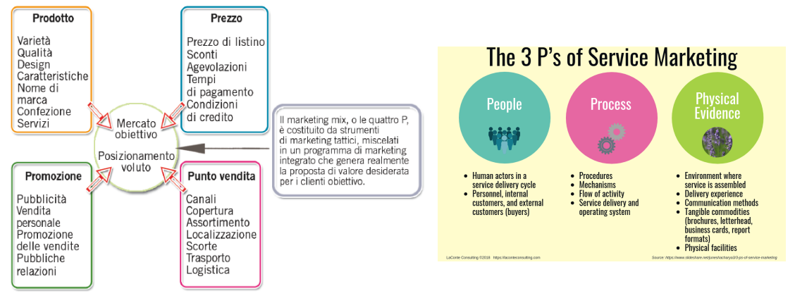
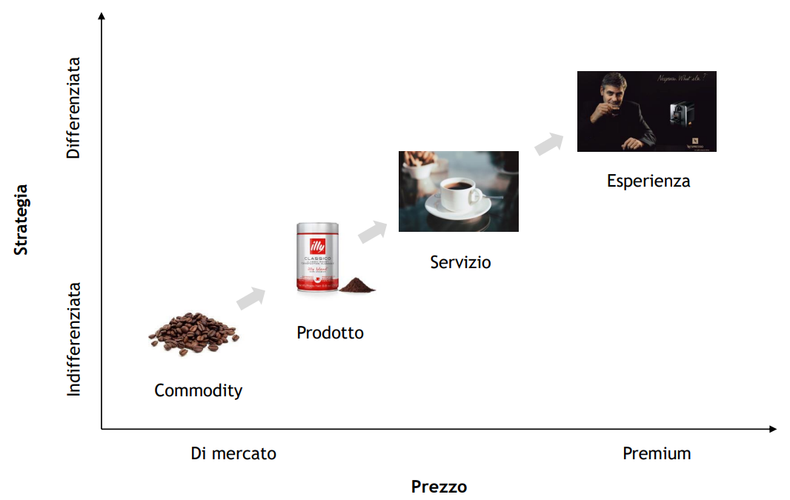
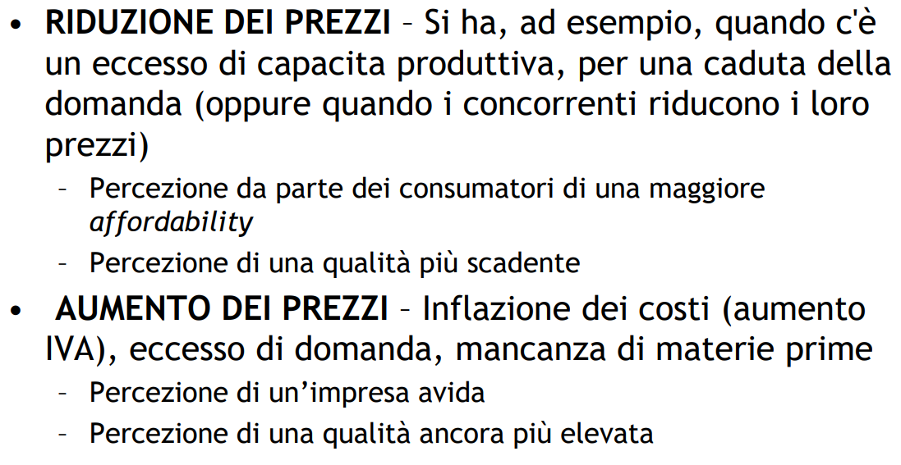

# Marketing Mix

Le 4 P sono state integrate anche di People, Process e Physical Evidence

## Prodotto

Ci si chiede "cosa acquista realmente il cliente". Il **prodotto effettivo** è rappresentato dalla marca, dalla qualità, dal design, dal packaging... mentre features come finanziamenti, garanzia e assistenza fanno parte del **prodotto ampliato** che aumentano il valore per il cliente.

### Brand Equity

- Immagine - come è rappresentato il brand nella mente dei clienti

- Forza - grado di attaccamento del cliente (meno sensibile ai prezzi, tasso di riacquisto, tasso di esclusvità)

- Valore - valore finanziario della marca

## Prezzo

Importo in denaro richiesto per un determinato prodotto o servizio oppure, in senso più ampio, la somma di tutti i 
valori che i consumatori scambiano con i benefici derivanti dal possesso o dall’utilizzo di un prodotto o servizi.

Unico elemento del marketing mix che produce un **ricavo**: tutti gli altri generano un costo

Il prezzo è determinato da:

- Domanda -> p. max

- Costi - p. min

- Concorrenza sul mercato

### Strategie di prezzo per nuovi prodotti

- Market-skimming price: prezzo elevato al lancio per poi scendere col tempo verso nuovi clienti

- Market-penetration price: prezzo basso al lancio per puntare sui volumi di vendita

### Strategie di prezzo per mix di prodotti

- Prezzi per linee di prodotti

- Prezzi per elementi opzionali (es. auto)

- Prezzi di prodotti ausiliari o complementari (es. inchiostro per stampante)

- Prezzi dei sotto-prodotti (es. scarti)

- Prezzi dei pacchetti di prodotto

### Manovre di aggiustamento dei prezzi

- Sconti

- Discriminazioni di prezzo

- Prezzi psicologici (prezzo elevato = qualità)

- Prezzi promozionali

- Prezzi geografici

- Prezzi dinamici

## Place

Si punta ai **canali di distribuzione**, specialmente sulla catena di fornitura a valle. Ci si affida a **intermediari** perché sono specialisti nella vendita e conviene dal punto di vista dei costi. Il canale di distribuzione può essere diretto al consumatore o tramite uno o più intermediari (agente, whole sale, reatailer): questi ultimi cercano di lavorare insieme e non come una catena.

### Un sistema di marketing verticale: Franchising

Un sistema di **franchising** (una particolare forma di sistema verticale) è un sistema di singoli franchisee, un gruppo affiatato di imprese le cui operazioni sistematiche sono pianificate, dirette e controllate dal franchisor. Il **franchisor** è proprietario di un marchio di fabbrica o di servizio e lo concede in licenza ai franchisee in cambio del pagamento di royalties. Il **franchisee** paga per il diritto di far parte del sistema. Il franchisor fornisce ai suoi franchisee gli strumenti per condurre il business.

### Un sistema di marketing orizzontale: Partnership

Partnership tra aziende dello stesso livello della catena di fornitura. Sinergie nelle attività di marketing e **maggiore efficacia** grazie all’unione delle proprie risorse. Le aziende **ampliano/completano** la loro gamma di prodotti

### Conflitti

è possibile che diversificare i canali di distribuzione provochi conflitti interni o esterni (es. e-commerce)

## Promozione

Le aziende usano al promozione per comunicare il valore in modo chiaro e persuasivo. La promozione è un insieme a sua volta di strumenti.

- Pubblicità

- Promozioni delle vendite

- Public Relations

- Marketing Diretto

- Personal Selling
