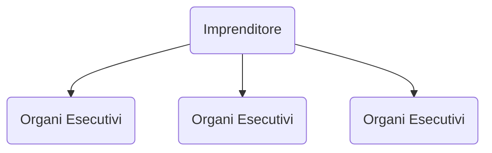
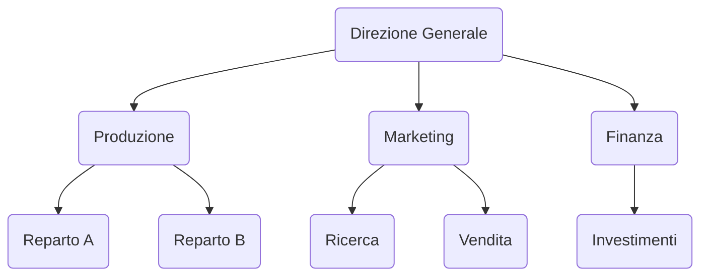
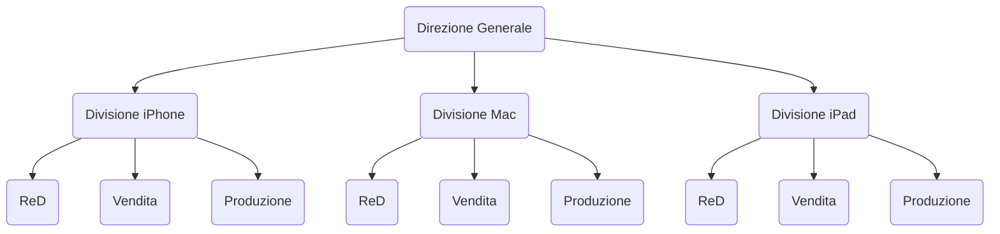

# Introduzione

## Obiettivi

Introdurre alla Supply Chain e all'organizzazione di essa, logistica, sostenibilità, gestione strategica dei fornitori, sviluppo prodotto. Ancora sustainable supply chain, circular economy, digital transformation. 

Mail: `marco.formentini@unitn.it`

*framework del corso*

## Organizzazione

È un'entità sociale compelssa, progettata, strutturata e coordinata, guidata da obiettivi e composta da persone che si dividono il lavoro, secondo una gerarchia, per essere più produttivi e rapportarsi meglio con l'ambiente esterno.

*Tonchia*

Essa si occupa di:

- definire le attività da svolgere

- definire unità organizzative

- coordinare e disciplinare le attività di impresa

- definire responsabilità e compiti

L'organizzazione nasce per **creare valore**, fornire prodotti o servizi ai **clienti** e generare **profitto**.

## Risorse

Fattori produttivi (acquistabili con il capitale)

- Consumabili (es. materie prime)

- Beni ammortizzabili (es. macchinari, attrezzature)

- Risorse umane

Ma anche relazioni col mondo esterno (es. partner) e *know how*. 

## La gestione delle risorse umane

- Verticale - "gerarchia"

- Orizzontale - "divisione del lavoro in base alla specializzazione"

*immagine piramide organi aziendali*

Gli **organi di staff** supportano gli altri organi (es. suggerimenti ai manager di linea).

### Struttura organizzativa

Definisce i compiti e le aree di intervento delle unità organizzative ed operative raggruppandoli per **specializzazioni**.

- plurifunzionale (INPUT) - divisione per processo produttivo

- multidivisionale (OUTPUT) - divisione per famiglie di prodotti, geografica, logistica

- a matrice (IN & OUT)

### SIstemi operativi

Vanno a supporto delle decisioni (es. Sistemi Informativi Aziendali)

- SAP

- DSS: Decision Support System

- CRM: Customer Relationship Management

### Organigramma

È la rappresentazione grafica delle strutture organizzative.

- Chiariscono gli organi e le funzioni

- Delimitano i compiti e le aree

- Precisano le relazioni gerarchiche

## Strutture Organizzative

Le scelte organizzative consentono all'intera gestione aziendale di conseguire obiettivi di massima **efficacia** (risultato) ed **efficienza** (risorse). 

### Efficacia

$$
\frac{Risultati\space conseguiti}{Risultati\space attesi}
$$

### Efficienza

$$
\frac{Output\space ottenuti}{Input\space utilizzati}
$$

### Struttura Semplice

- Tipica delle aziende piccole

- Funzioni direttive in capo all'imprenditore

- Bassa specializzazione e alta intercambiabiiltà

- Decisioni rapide e flessibili

### Struttura Plurifunzionale

- Il lavoro all'interno è suddiviso orizzontalmente (aree)

- Gerarchia molto sviluppata

- Decentramento limitato

Ottimizza l'efficienza in generale, incrementa la specializzazione, economia di scala e flessibilità operativa. Tuttavia l'eccessiva specializzazione potrebbe penalizzare l'efficacia, rendendo più difficile la comunicazione e la collaborazione fra le varie aree.

### Struttura Multidivisionale

- Le attività sono organizzate in **divisioni**. Non si lavora con aree funzionali ma per **linee di prodotto** o **posizione geografiche**

- La singola divisione avrà delle aree funzionali

Oppure come esempio geografico c'è quello del settore auto (USA e Europa). 

Il vantaggio è una gestione e coordinamento diversificati, con focus su aspetti strategici e controllo. Tende però a esserci una minore efficienza globale e ridondanza di organi. Possibili conflitti fra divisioni.

### Struttura a Matrice

- Tipica delle imprese "**a progetto**" o su commessa. 

- Le attività sono organizzate per tecnica/funzione e per prodotto/clientela

- I **responsabili di progetto** controllano l'operato dei singoli gruppi/progetti.

Efficacia ed efficienza, suddividendo il potere. Flessibile. Origina precarietà e insicurezza nel personale e aumenta il rischio di ritardi.

### Mix

Possono svilupparsi soluzioni ibride.

## Business Process Reengineering

La **logica di processo** consiste nel cercare i processi che creano maggiore valore al cliente. I processi sono trasversali agli organi dell'azienda.

**Input** [risorse trasformate]: Materie prime, ricerche di mercato (informazioni)

**Risorse** [risorse per trasformare]: Personale, strumenti, competenze

**Output**: Prodotto o Servizio

### I meccanismi di coordinameto del lavoro

- Obiettvi

- Piani e Programmi

- Mansionari
  
  - chiariscono i compiti che ciascuna posizione organizzativa deve svolgere

- Norme Procedurali
  
  - indicano le modalità di esecuzione dei computi

- Stili di Leadership
  
  - il comportamento degli organi direttivi alle posizioni subordinate

## Azienda, Impresa, Società

- **Azienda**: aspetto materiale connesso con il dispiegamento delle risorse

- **Impresa**: sottolinea l'attività imprenditoriale

- **Società**: concretizza in termini giuridici le precedenti

- Società di Persone (ss, snc, sas) - personale

- Società di Capitali (srl, spa, sapa) - fino al capitale

Cambia la responsabilità dell'azienda.

## Governance

Insieme delle regole dell’impresa come istituzione (soggetto giuridico), secondo le quali l’impresa è gestita e controllata, a completamento degli obblighi derivanti dalle leggi e norme cogenti

- Assemblea dei Soci - ordinaria e straordinaria

- CdA

- Collegio Sindacale - revisione dei conti

- Amministratore Delegato - finalizzatore dell'investimento dei soci

- Direttore Generale - coordinatore

## Ambiente, mercati e settori

- **Ambiente**: contesto in cui lavora l'azienda

- **Mercato**: dove avviene lo scambio di risorse

- **Settori**: raggruppamento strategico

## Performance

- Utile = Ricavi - Costi

- Redditività = Utile / Investimento

Essi sono determinati da una **gestione azindale caratteristica** (operazioni normali), **gestione aziendale extra-caratteristica** (ricerca capitale) e **congiuntura economica** (fattori di contesto, istituzionali e di mercato, non controllabili)

**Leve Operative**: tecnologiche, organizzative e gestionali. Agiscono sulle prestazioni operative (interne).

- **cost** costi e produttività -> impatto sulla redditività

- **non cost** qualità e tempo -> impatto su prestazioni esterne (es. prodotto, servizio: visione dall'esterno dell'azienda) -> impatto sull'utile

## Teorie del pensiero organizzativo

### Strutture

**Teorie sul soggetto**

- Teorie della scuola classica

- Teorie della scuola delle relazioni umane - Teorie motivazionali

**Teorie sui sistemi**

- Funzionalismo

- Neoistituzionalismo

- Teoria della contingenza

- Teoria dei costi di transazione

### Approccio

- Deterministico (visione economica, burocratica)

- Possibilistico (considera gli elementi comportamentali degli individui)

|          | Deterministico                        | Possibilistico                                                     |
| -------- | ------------------------------------- | ------------------------------------------------------------------ |
| Soggetti | Teorie della scuola classica          | Teorie della scuola delle relazioni umane Teorie motivazionali |
| Sistemi  | Funzionalismo Neoistituzionalismo | Teoria della contingenza   Teoria dei costi di transazione     |

### La scuola classica

- *Scientific management* di Taylor - attraverso una selezione scientifica dell'operaio, simil Hanry Ford, retribuzione a cottimo

- Teoria amministrativa di Fayol - rende scientifica l'attività di Direzione, suddivide in *funzioni*, prospettiva gerarchica

- Teoria burocratica di Weber - 

### La scuola delle relazioni umane

Le persone si adattavano in base alla richiesta -> fattore psicologico: le operaie producevano di più perché sotto esperimento. 

**Piramide di Maslow**

- Teoria di Likert - stile di manager
  
  - stile autoritario
  
  - stile paternalistico
  
  - stile consultivo
  
  - stile partecipativo

### La teoria della contingenza

Il modello da preferire dipende da una serie di fattori **contingenti**

- con. ambientale - instabili o stabili

- con. strategica - 

- con. teconologica

- con. dimensionale

### La teoria dei costi di transazione

*Make or Buy*: ci conviene autocostruirci un prodotto o comprarlo da un fornitore?

**Costi di transazione**: scambi di beni e sevizi, relazioni. Migliorato con la digitalizzazione.

**Assimmetria Infromativa**: opportunismo, il fornitore potrebbe "fregare" il compratore, che non conosce l'ambito.

**Transaction Cost Economics**: in bassa presenza di opportunismo, converrebbe l'acquisto esterno. Nell'esempio del contesto automotive invece, per alcuni componenti importanti, converrebbe controllare il processo. Un'opzione è anche *inglobare il fornitore*. Importanza anche dei **contratti (ad-hoc agreements)** o anche delle **joint venture**.

### Teorie più recenti

- Investimenti e risorse nel core business

- Outsourcing

- MInore gerarchia

- Sviluppo di relazioni strategiche-operative
